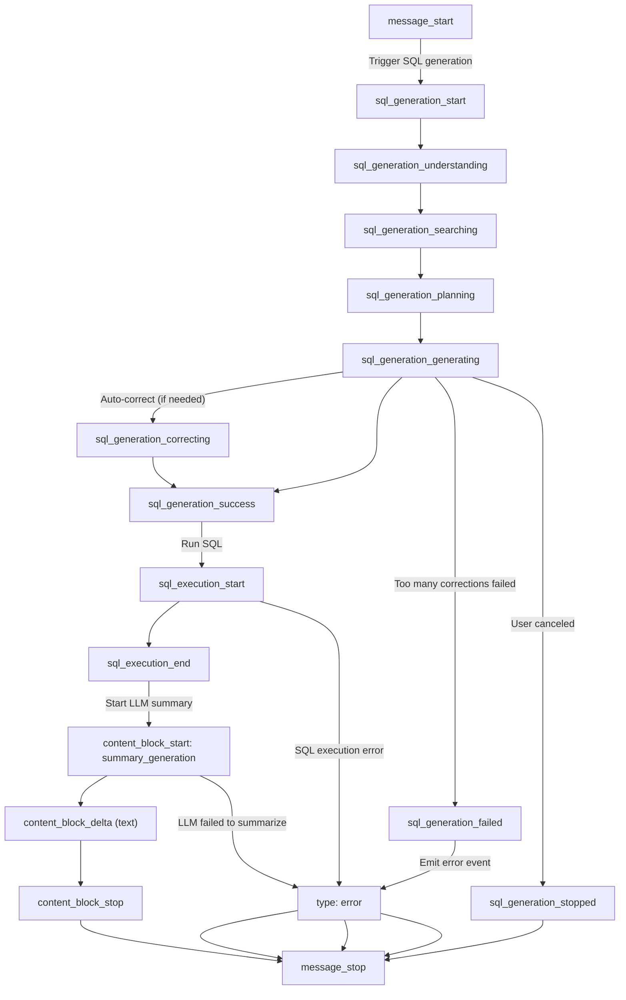
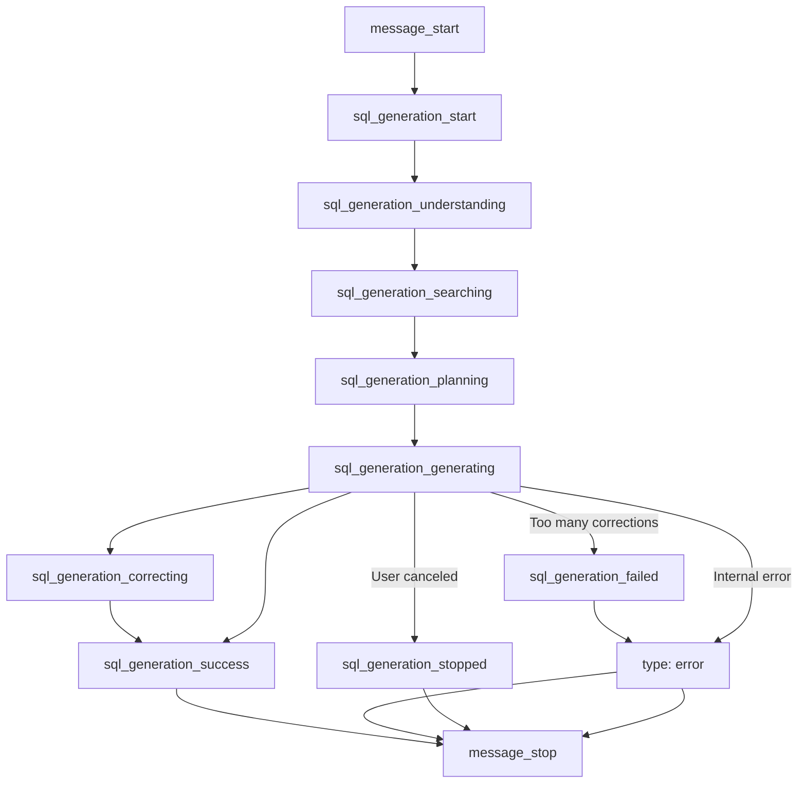

# Query & Answering

Wren AI provides a powerful text-to-SQL interface that lets users query databases using natural language.

Wren AI exposes core APIs for answering user questions — including generating SQL from questions, executing queries, explaining results, and producing natural language summaries.

## Endpoints Overview

* `POST /ask`: Ask a question and get a direct answer from the AI.
* `POST /generate_sql`: Convert a natural language question into a SQL query.
* `POST /run_sql`: Execute SQL and return structured results.
* `POST /generate_summary`: Generate a natural language summary from .
* `GET /stream_explanation`: Stream natural language explanations for non-SQL questions.

Use these endpoints to build interactive and intelligent data experiences.

<br />

## Base URL & Authentication

All API requests must be directed to the gateway base URL:

```
http://188.107.223.24:3001
```

### 🔐 Authentication

API access is secured using an API Key authentication mechanism via Nginx. You must include the following header in all requests:

* **Header Name**: `X-API-KEY`
* **Header Value**: Your assigned API Key (e.g., `zhushuhan123`)

If the header is missing or contains an invalid key, the gateway will return a `401 Unauthorized` response:
```json
{
  "error": "Unauthorized",
  "message": "Invalid or missing X-API-KEY header."
}
```

### 🚦 Rate Limiting & Restrictions

To ensure service stability, the API gateway enforces the following policies:

* **Rate Limit**: Maximum of **15 requests per second (r/s)** per IP address, with a burst buffer of up to **25 requests**.
* **Path Access**: Only paths starting with `/api/v1/` or `/api/graphql` are allowed. Attempting to access other paths will return a `403 Forbidden` error.
* **Timeout Limit**: Connection and proxy timeout thresholds are set to **300 seconds (5 minutes)** to support long-running tasks.

<br />

## When to Use Which API

Wren AI APIs are designed to be modular — you can either call a single all-in-one API or chain multiple endpoints together for more control and flexibility.

### 🔹 For simple questions

Use this when you just want to ask a question and get an answer:

| Scenario                                                                                    | Use This    |
| :------------------------------------------------------------------------------------------ | :---------- |
| I want to ask a question and get an answer (AI will generate SQL, run it, and summarize it) | /ask        |
| I want a streamed version with reasoning and progress updates                               | /stream/ask |

<br />

### 🔹 For advanced or modular workflows

Use these if you want more control over each step:

| Step                                       | API                                      |
| :----------------------------------------- | :--------------------------------------- |
| Convert question to SQL                    | /generate\_sql, or /stream/generate\_sql |
| Execute the SQL                            | /run\_sql                                |
| Summarize the SQL result                   | /generate\_summary                       |
| Get explanation when SQL is not applicable | /stream\_explanation                     |

<br />

### 💡 Common Combinations

You can mix and match these endpoints based on your product needs.

* `/generate_sql` → `/run_sql` → `/generate_summary`

  For building **interactive BI tools** or **workflows** where SQL needs review, logging, or step-by-step handling.
* `/ask`

  Best for **chat interfaces** or **quick answers** with minimal effort.
* `/stream/ask`

  Best for frontend apps that want to **display real-time progress**, similar to ChatGPT-style interactions.

# ask

Converts your question to SQL, runs it, and provides insights about the data

The `/ask` endpoint combines the capabilities of `/generate_sql` and `/generate_summary` into a single, intelligent API.

It allows users to ask questions in natural language. If the question can be translated into a SQL query, the system automatically:

1. Generates the SQL
2. Executes the SQL statement
3. Summarizes the result in natural language

If the question is unrelated to the data (e.g., a greeting or product question), the system will return a direct explanation instead.

> 💡 Want a more interactive experience?
>
> If your query takes a bit longer or you want users to see **what’s happening behind the scenes**, consider using the streaming version (`/stream/ask`).\
> It gives **step-by-step updates** so users know what stage the system is in — from understanding to SQL generation, execution, and summarization.

<br />

## Basic Usage

```json Request
{
  "question": "List the top 5 states with the most customers"
}

```

```json Response
{
  "id": "a1b2c3d4-e5f6-7890-abcd-ef1234567890",
  "sql": "SELECT customer_state, COUNT(*) as customer_count FROM customers GROUP BY customer_state ORDER BY customer_count DESC LIMIT 5",
  "summary": "São Paulo (SP) leads with 15,847 customers, followed by Rio de Janeiro (RJ) and Minas Gerais (MG).",
  "threadId": "9c537507-9cec-46ed-b877-07bfa6322bed"
}

```

<br />

## Non-SQL Query Handling

When a natural language query **cannot be converted to SQL**, this endpoint delivers a response that explains what the system can help with.

For example:

```json Request
{
  "question": "Hi there"
}
```

```json Response
{  
  "id": "a1b2c3d4-e5f6-7890-abcd-ef1234567890",
  "type": "NON_SQL_QUERY",
  "explanation": "I am a data assistant that helps answer questions about your data. You can ask me things like 'Show sales by product.'"
}
```

This typically happens when the query is general, vague, or not related to any known table or data schema.

<br />

## Conversation Context

You can use the `threadId` returned in the response to ask follow-up questions while maintaining context:

```javascript
// Follow-up question
{
  "question": "List top 3 instead",
  "threadId": "9c537507-9cec-46ed-b877-07bfa6322bed"
}

// Response
{
  "id": "a1b2c3d4-e5f6-7890-abcd-ef1234567890",
  "sql": "SELECT customer_state, COUNT(*) as customer_count FROM customers GROUP BY customer_state ORDER BY customer_count DESC LIMIT 3",
  "summary": "...",
  "threadId": "9c537507-9cec-46ed-b877-07bfa6322bed"
}
```

<br />

## Error handling

Common Error Codes

* `NO_DEPLOYMENT_FOUND` – No active deployment for the current project.
* `POLLING_TIMEOUT` – Timed out while waiting for AI response.
* `INVALID_SQL_ERROR` – The generated SQL could not be executed (e.g. due to a schema mismatch).
* `INTERNAL_SERVER_ERROR` – An unknown error occurred on the server.

### Error example: SQL Generation Fails After Correction

When SQL generation fails during execution (even after internal correction attempts), the API returns:

```json Invalid SQL Error
{
  "id": "34f7a6de-b9b8-4c2b-8c6a-ffecebb7b8a2",
  "code": "INVALID_SQL_ERROR",
  "error": "Column 'customer_namme' does not exist in table 'customers'",
  "invalidSql": "SELECT customer_namme FROM customers",
  "threadId": "9c537507-9cec-46ed-b877-07bfa6322bed"
}
```

* `error`: The exact error message returned by the database. This often includes syntax issues or column/table name problems.
* `invalidSql`: The final SQL statement that failed during execution.

These fields help you:

* Debug the issue more effectively
* Inform the user which part of the query might need adjustment
* Log failures for review or reporting

# OpenAPI definition

```json
{
  "openapi": "3.0.0",
  "info": {
    "title": "WrenAI API",
    "description": "Restful API for interacting with Wren AI",
    "version": "1.0.0"
  },
  "servers": [
    {
      "url": "/api/v1",
      "description": "WrenAI API v1"
    }
  ],
  "paths": {
    "/ask": {
      "post": {
        "summary": "Ask a question in natural language",
        "description": "Converts your question to SQL, runs it, and provides insights about the data",
        "requestBody": {
          "required": true,
          "content": {
            "application/json": {
              "schema": {
                "type": "object",
                "required": [
                  "question"
                ],
                "properties": {
                  "question": {
                    "type": "string",
                    "description": "The natural language question to convert to SQL"
                  },
                  "threadId": {
                    "type": "string",
                    "description": "Optional thread ID to maintain conversation context"
                  },
                  "language": {
                    "type": "string",
                    "description": "Optional language override for AI responses. If not provided, will use the project's default language. Affects error messages and explanation responses. The format is not strictly enforced, but it is recommended to follow the language list in RFC 5646 (check https://gist.github.com/msikma/8912e62ed866778ff8cd for reference)."
                  },
                  "sampleSize": {
                    "type": "integer",
                    "description": "Number of rows from SQL results to include in AI context for summary generation",
                    "default": 500
                  }
                }
              }
            }
          }
        },
        "responses": {
          "200": {
            "description": "Successfully generated SQL and summary",
            "content": {
              "application/json": {
                "schema": {
                  "type": "object",
                  "properties": {
                    "id": {
                      "type": "string",
                      "description": "The unique identifier for the response"
                    },
                    "sql": {
                      "type": "string",
                      "description": "The generated SQL statement"
                    },
                    "summary": {
                      "type": "string",
                      "description": "The generated summary of the data"
                    },
                    "threadId": {
                      "type": "string",
                      "description": "ID of the thread (existing or newly created)"
                    },
                    "type": {
                      "type": "string",
                      "description": "Type of response (SQL_QUERY or NON_SQL_QUERY)"
                    },
                    "explanation": {
                      "type": "string",
                      "description": "Explanation for non-SQL queries"
                    }
                  },
                  "example": {
                    "id": "a1b2c3d4-e5f6-7890-abcd-ef1234567890",
                    "sql": "SELECT customer_state, COUNT(*) as customer_count FROM customers GROUP BY customer_state ORDER BY customer_count DESC LIMIT 10",
                    "summary": "The data shows that São Paulo (SP) has the highest number of customers with 15,847 customers, followed by Rio de Janeiro (RJ) with 12,832 customers. The top 5 states account for over 60% of all customers in the dataset.",
                    "threadId": "9c537507-9cec-46ed-b877-07bfa6322bed"
                  }
                }
              }
            }
          },
          "400": {
            "description": "Bad request or unable to process question",
            "content": {
              "application/json": {
                "schema": {
                  "$ref": "#/components/schemas/ErrorResponse"
                }
              }
            }
          }
        }
      }
    }
  },
  "components": {
    "schemas": {
      "ErrorResponse": {
        "type": "object",
        "properties": {
          "id": {
            "type": "string",
            "description": "Unique identifier for the error response"
          },
          "error": {
            "type": "string",
            "description": "Error message"
          },
          "code": {
            "type": "string",
            "description": "Error code"
          }
        }
      }
    }
  }
}
```

# generate_sql

Converts a natural language question into a SQL query

The `/generate_sql` endpoint converts natural language questions into SQL queries. It allows you to interact with your database using natural language.

> 📘 When to use this
>
> * You want to **translate a natural language question into SQL**, without running or summarizing the result yet.
> * You are building a workflow where SQL needs to be reviewed, modified, or approved **before execution**.
> * You want to **debug or fine-tune** the generated SQL separately from other steps.
> * You want to chain SQL generation with manual or automated execution (e.g., send SQL to `/run_sql`, or to `/generate_summary`).
>
> For an all-in-one experience (question → SQL → result → summary), use the `/ask` endpoint instead.

## Basic Usage

To generate a SQL query, send a request with your question:

```javascript
// Request
{
  "question": "Show me all customers"
}

// Response
{
  "id": "1fbc0d64-1c58-45b2-a990-9183bbbcf913",
  "sql": "SELECT * FROM \"olist_customers_dataset\"",
  "threadId": "9c537507-9cec-46ed-b877-07bfa6322bed"
}
```

<br />

## Conversation Context

You can use the `threadId` returned in the response to ask follow-up questions while maintaining context:

```javascript
// Follow-up question
{
  "question": "list top 10 only",
  "threadId": "9c537507-9cec-46ed-b877-07bfa6322bed"
}

// Response
{
  "id": "2589615b-abbd-48b0-926f-128faa96a87e",
  "sql": "SELECT * FROM \"olist_customers_dataset\" ORDER BY \"customer_id\" ASC LIMIT 10",
  "threadId": "9c537507-9cec-46ed-b877-07bfa6322bed"
}
```

<br />

## Executing Queries

Once you have the SQL, you can:

* Pass the SQL to the `/run_sql` endpoint to execute the query and get results
* Use the `returnSqlDialect: true` parameter to get SQL in your database's native dialect and run it directly in your database

## Non-SQL Query Handling

If your question can't be converted to SQL, you'll receive an error response with the following fields:

* `id`: A unique identifier for the error response
* `code`: An error code indicating the type of issue encountered:
  * `NON_SQL_QUERY`: The question cannot be translated to SQL because it's unrelated to data querying
  * `NO_DEPLOYMENT_FOUND`: No active deployment was found for the project
  * `POLLING_TIMEOUT`: The operation timed out while waiting for a response from the AI service
* `error`: A human-readable description explaining why the query couldn't be translated to SQL
* `explanationQueryId`: An identifier you can use to get a more detailed explanation

```javascript
// Example 1: Asking question "hello"
{
  "id": "e593369b-e222-4435-b874-dc10edb12a96",
  "code": "NON_SQL_QUERY",
  "error": "Vague greeting unrelated to schema, SQL, or user guide; no specific intent identified.",
  "explanationQueryId": "475afc1f-7950-4bc7-a248-a7da394d137a"
}

// Example 2: Asking question "what could you do"
{
  "id": "75c13d09-6f86-4e79-a00e-a4f85f73f2d7",
  "code": "NON_SQL_QUERY",
  "error": "User asks about Wren AI's features and capabilities, unrelated to database schema.",
  "explanationQueryId": "71b016c5-42bb-4897-82d6-46f9b0bf7d94"
}
```

Use the `explanationQueryId` with the `/stream_explanation` endpoint to receive a detailed explanation response streamed as events.

# OpenAPI definition

```json
{
  "openapi": "3.0.0",
  "info": {
    "title": "WrenAI API",
    "description": "Restful API for interacting with Wren AI",
    "version": "1.0.0"
  },
  "servers": [
    {
      "url": "/api/v1",
      "description": "WrenAI API v1"
    }
  ],
  "paths": {
    "/generate_sql": {
      "post": {
        "summary": "Generate SQL from natural language",
        "description": "Converts a natural language question into a SQL query",
        "requestBody": {
          "required": true,
          "content": {
            "application/json": {
              "schema": {
                "type": "object",
                "required": [
                  "question"
                ],
                "properties": {
                  "question": {
                    "type": "string",
                    "description": "The natural language question to convert to SQL"
                  },
                  "threadId": {
                    "type": "string",
                    "description": "Optional thread ID to maintain conversation context"
                  },
                  "language": {
                    "type": "string",
                    "description": "Optional language override for AI responses. If not provided, will use the project's default language. Affects error messages and explanation responses. The format is not strictly enforced, but it is recommended to follow the language list in RFC 5646 (check https://gist.github.com/msikma/8912e62ed866778ff8cd for reference)."
                  },
                  "returnSqlDialect": {
                    "type": "boolean",
                    "description": "Whether to return the SQL dialect in the response. If true, the SQL returned will be in the dialect of the database.",
                    "default": false
                  }
                }
              }
            }
          }
        },
        "responses": {
          "200": {
            "description": "Successfully generated SQL",
            "content": {
              "application/json": {
                "schema": {
                  "type": "object",
                  "properties": {
                    "id": {
                      "type": "string",
                      "description": "The unique identifier for the response"
                    },
                    "sql": {
                      "type": "string",
                      "description": "The generated SQL statement"
                    },
                    "threadId": {
                      "type": "string",
                      "description": "ID of the thread (existing or newly created)"
                    }
                  },
                  "example": {
                    "id": "1fbc0d64-1c58-45b2-a990-9183bbbcf913",
                    "sql": "SELECT * FROM \"olist_customers_dataset\"",
                    "threadId": "9c537507-9cec-46ed-b877-07bfa6322bed"
                  }
                }
              }
            }
          },
          "400": {
            "description": "Bad request or unable to generate SQL",
            "content": {
              "application/json": {
                "schema": {
                  "allOf": [
                    {
                      "$ref": "#/components/schemas/ErrorResponse"
                    },
                    {
                      "type": "object",
                      "properties": {
                        "explanationQueryId": {
                          "type": "string",
                          "description": "ID that can be used with the /stream_explanation endpoint to get a detailed explanation for non-SQL queries"
                        }
                      }
                    }
                  ],
                  "example": {
                    "id": "75c13d09-6f86-4e79-a00e-a4f85f73f2d7",
                    "code": "NON_SQL_QUERY",
                    "error": "User asks about Wren AI's features and capabilities, unrelated to database schema.",
                    "explanationQueryId": "71b016c5-42bb-4897-82d6-46f9b0bf7d94"
                  }
                }
              }
            }
          }
        }
      }
    }
  },
  "components": {
    "schemas": {
      "ErrorResponse": {
        "type": "object",
        "properties": {
          "id": {
            "type": "string",
            "description": "Unique identifier for the error response"
          },
          "error": {
            "type": "string",
            "description": "Error message"
          },
          "code": {
            "type": "string",
            "description": "Error code"
          }
        }
      }
    }
  }
}
```

# run_sql

Runs a SQL query and returns the results as structured data

The `/run_sql` endpoint executes SQL queries against your database and returns the results as structured data. This endpoint can be used to run SQL queries generated by the `/generate_sql` endpoint or custom SQL queries you've written.

## Basic Usage

```javascript
// Request
{
  "sql": "SELECT * FROM \"olist_customers_dataset\" LIMIT 10"
}

// Response
{
  "id": "09d46224-0068-4ca3-bce4-f1fc85093eb6",
  "records": [
    {
      "customer_id": "00012a2ce6f8dcda20d059ce98491703",
      "customer_unique_id": "248ffe10d632bebe4f7267f1f44844c9",
      "customer_zip_code_prefix": "06273",
      "customer_city": "osasco",
      "customer_state": "SP"
    },
    {
      "customer_id": "000161a058600d5901f007fab4c27140",
      "customer_unique_id": "b0015e09bb4b6e47c52844fab5fb6638",
      "customer_zip_code_prefix": "35550",
      "customer_city": "itapecerica",
      "customer_state": "MG"
    },
    "... additional records ..."
  ],
  "columns": [
    {
      "name": "customer_id",
      "type": "VARCHAR"
    },
    {
      "name": "customer_unique_id",
      "type": "VARCHAR"
    },
    {
      "name": "customer_zip_code_prefix",
      "type": "VARCHAR"
    },
    {
      "name": "customer_city",
      "type": "VARCHAR"
    },
    {
      "name": "customer_state",
      "type": "VARCHAR"
    }
  ],
  "threadId": "503a8ca5-8171-43b5-b45b-86de2849467b",
  "totalRows": 10
}
```

<br />

## Error Handling

```javascript
{
  "id": "6fb82c31-a40d-4b8e-9e5f-c1d8a742db76",
  "code": "DATABASE_ERROR",
  "error": "Error executing SQL: Table 'nonexistent_table' doesn't exist"
}
```

Error codes may include:

* `DATABASE_ERROR`: An error occurred while executing the SQL query
* `INVALID_SQL`: The SQL syntax is invalid
* `NO_DEPLOYMENT_FOUND`: No active database connection was found

## Workflow Example

1. Generate SQL using the `/generate_sql` endpoint
2. Pass the generated SQL to `/run_sql` to execute and get results
3. Optionally use the same `threadId` in follow-up queries to maintain context

# OpenAPI definition

```json
{
  "openapi": "3.0.0",
  "info": {
    "title": "WrenAI API",
    "description": "Restful API for interacting with Wren AI",
    "version": "1.0.0"
  },
  "servers": [
    {
      "url": "/api/v1",
      "description": "WrenAI API v1"
    }
  ],
  "paths": {
    "/run_sql": {
      "post": {
        "summary": "Execute SQL and return results",
        "description": "Runs a SQL query and returns the results as structured data",
        "requestBody": {
          "required": true,
          "content": {
            "application/json": {
              "schema": {
                "type": "object",
                "required": [
                  "sql"
                ],
                "properties": {
                  "sql": {
                    "type": "string",
                    "description": "The SQL query to execute"
                  },
                  "threadId": {
                    "type": "string",
                    "description": "Optional thread ID for conversation context"
                  },
                  "limit": {
                    "type": "integer",
                    "description": "Maximum number of rows to return",
                    "default": 1000
                  }
                }
              }
            }
          }
        },
        "responses": {
          "200": {
            "description": "Successfully executed SQL",
            "content": {
              "application/json": {
                "schema": {
                  "type": "object",
                  "properties": {
                    "records": {
                      "type": "array",
                      "description": "Array of records, each represented as an object",
                      "items": {
                        "type": "object"
                      }
                    },
                    "columns": {
                      "type": "array",
                      "description": "Metadata about the result columns",
                      "items": {
                        "$ref": "#/components/schemas/ColumnMetadata"
                      }
                    },
                    "threadId": {
                      "type": "string",
                      "description": "ID of the thread (existing or newly created)"
                    },
                    "totalRows": {
                      "type": "integer",
                      "description": "The total number of rows returned"
                    }
                  },
                  "example": {
                    "id": "09d46224-0068-4ca3-bce4-f1fc85093eb6",
                    "records": [
                      {
                        "customer_id": "00012a2ce6f8dcda20d059ce98491703",
                        "customer_unique_id": "248ffe10d632bebe4f7267f1f44844c9",
                        "customer_zip_code_prefix": "06273",
                        "customer_city": "osasco",
                        "customer_state": "SP"
                      },
                      {
                        "customer_id": "000161a058600d5901f007fab4c27140",
                        "customer_unique_id": "b0015e09bb4b6e47c52844fab5fb6638",
                        "customer_zip_code_prefix": "35550",
                        "customer_city": "itapecerica",
                        "customer_state": "MG"
                      },
                      "... additional records truncated for brevity ..."
                    ],
                    "columns": [
                      {
                        "name": "customer_id",
                        "type": "VARCHAR"
                      },
                      {
                        "name": "customer_unique_id",
                        "type": "VARCHAR"
                      },
                      {
                        "name": "customer_zip_code_prefix",
                        "type": "VARCHAR"
                      },
                      {
                        "name": "customer_city",
                        "type": "VARCHAR"
                      },
                      {
                        "name": "customer_state",
                        "type": "VARCHAR"
                      }
                    ],
                    "threadId": "503a8ca5-8171-43b5-b45b-86de2849467b",
                    "totalRows": 10
                  }
                }
              }
            }
          },
          "400": {
            "description": "Bad request or SQL execution error",
            "content": {
              "application/json": {
                "schema": {
                  "$ref": "#/components/schemas/ErrorResponse"
                }
              }
            }
          },
          "405": {
            "description": "Method not allowed",
            "content": {
              "application/json": {
                "schema": {
                  "$ref": "#/components/schemas/ErrorResponse"
                }
              }
            }
          }
        }
      }
    }
  },
  "components": {
    "schemas": {
      "ErrorResponse": {
        "type": "object",
        "properties": {
          "id": {
            "type": "string",
            "description": "Unique identifier for the error response"
          },
          "error": {
            "type": "string",
            "description": "Error message"
          },
          "code": {
            "type": "string",
            "description": "Error code"
          }
        }
      },
      "ColumnMetadata": {
        "type": "object",
        "properties": {
          "name": {
            "type": "string",
            "description": "Column name"
          },
          "type": {
            "type": "string",
            "description": "Data type of the column"
          },
          "notNull": {
            "type": "boolean",
            "description": "Whether the column allows null values"
          },
          "properties": {
            "type": "object",
            "description": "Additional column properties"
          }
        }
      }
    }
  }
}
```

# generate_summary

Generates a natural language summary from a SQL query and a question

The `/generate_summary` endpoint takes a user question and a SQL query, executes the SQL, and generates a natural language summary based on the result.

It is typically used after you've already generated or written a SQL query and want to provide an explanation for the data returned.

> 📘 When to use it
>
> * You’ve already written or generated SQL and want a natural summary of the result.
> * You want to provide a user-friendly explanation in dashboards, chat interfaces, or automated reports.
> * You need post-processing summarization after raw SQL execution.
>
> For a full pipeline (from question → SQL → result → summary), use the `/ask` endpoint instead.

## How it works

* You provide the original natural language question and the sql that was run.
* The system runs the query, samples the result (default `500` rows), and generates a user-friendly answer in natural language.
* You can customize the sample size and language.

<br />

## Basic usage

```json Request
{
  "question": "List the top 5 states with the most customers",
  "sql": "SELECT customer_state, COUNT(*) as customer_count FROM customers GROUP BY customer_state ORDER BY customer_count DESC LIMIT 5"
}
```

```json Response
{
  "id": "b2c3d4e5-f6g7-8901-bcde-f23456789012",
  "summary": "São Paulo (SP) leads with 15,847 customers, followed by Rio de Janeiro (RJ) and Minas Gerais (MG). These top 3 states account for over 50% of the customer base.",
  "threadId": "9c537507-9cec-46ed-b877-07bfa6322bed"
}
```

<br />

## Error handling

Common Error Codes

* `NO_DEPLOYMENT_FOUND` – No active deployment for the current project.
* `POLLING_TIMEOUT` – Timed out while waiting for AI response.
* `INVALID_SQL_ERROR` – The generated SQL could not be executed (e.g. due to a schema mismatch).
* `INTERNAL_SERVER_ERROR` – An unknown error occurred on the server.

# OpenAPI definition

```json
{
  "openapi": "3.0.0",
  "info": {
    "title": "WrenAI API",
    "description": "Restful API for interacting with Wren AI",
    "version": "1.0.0"
  },
  "servers": [
    {
      "url": "/api/v1",
      "description": "WrenAI API v1"
    }
  ],
  "paths": {
    "/generate_summary": {
      "post": {
        "summary": "Generate summary from a SQL query and a question",
        "description": "Generates a natural language summary from a SQL query and a question",
        "requestBody": {
          "required": true,
          "content": {
            "application/json": {
              "schema": {
                "type": "object",
                "required": [
                  "question",
                  "sql"
                ],
                "properties": {
                  "question": {
                    "type": "string",
                    "description": "The original question"
                  },
                  "sql": {
                    "type": "string",
                    "description": "The SQL query that was executed"
                  },
                  "threadId": {
                    "type": "string",
                    "description": "Optional thread ID for conversation context"
                  },
                  "language": {
                    "type": "string",
                    "description": "Optional language override for AI responses"
                  },
                  "sampleSize": {
                    "type": "integer",
                    "description": "Number of rows from SQL results to include in AI context for summary generation",
                    "default": 500
                  }
                }
              }
            }
          }
        },
        "responses": {
          "200": {
            "description": "Successfully generated summary",
            "content": {
              "application/json": {
                "schema": {
                  "type": "object",
                  "properties": {
                    "id": {
                      "type": "string",
                      "description": "The unique identifier for the response"
                    },
                    "summary": {
                      "type": "string",
                      "description": "The generated summary"
                    },
                    "threadId": {
                      "type": "string",
                      "description": "ID of the thread (existing or newly created)"
                    }
                  },
                  "example": {
                    "id": "b2c3d4e5-f6g7-8901-bcde-f23456789012",
                    "sql": "SELECT customer_state, COUNT(*) as customer_count FROM customers GROUP BY customer_state ORDER BY customer_count DESC LIMIT 10",
                    "summary": "Based on the SQL results, the analysis reveals significant regional distribution patterns. São Paulo leads with 15,847 customers, representing 23.4% of the total customer base. Rio de Janeiro follows with 12,832 customers (18.9%), while Minas Gerais has 8,945 customers (13.2%). This concentration in the Southeast region suggests strong market presence in Brazil's most populous areas.",
                    "threadId": "9c537507-9cec-46ed-b877-07bfa6322bed"
                  }
                }
              }
            }
          },
          "400": {
            "description": "Bad request or unable to generate summary",
            "content": {
              "application/json": {
                "schema": {
                  "$ref": "#/components/schemas/ErrorResponse"
                }
              }
            }
          }
        }
      }
    }
  },
  "components": {
    "schemas": {
      "ErrorResponse": {
        "type": "object",
        "properties": {
          "id": {
            "type": "string",
            "description": "Unique identifier for the error response"
          },
          "error": {
            "type": "string",
            "description": "Error message"
          },
          "code": {
            "type": "string",
            "description": "Error code"
          }
        }
      }
    }
  }
}
```

# stream_explanation

Streams an explanation for a non-SQL query using server-sent events

The `/stream_explanation` endpoint provides detailed explanations for non-SQL queries through server-sent events. When a natural language query cannot be converted to SQL, this endpoint delivers a streaming response that explains what the system can help with.

## Basic Usage

To receive a streaming explanation, use the explanationQueryId received from a previous `/generate_sql` request that returned a `NON_SQL_QUERY` error:

## Response Format

The response is a `text/event-stream` with each event containing a JSON message. The content is streamed in small chunks to provide a responsive experience:

```javascript
data: {"message":"Wren AI is "}

data: {"message":"designed to "}

data: {"message":"help you analyze "}

data: {"message":"your data with "}

data: {"message":"natural language queries. I can "}

data: {"message":"provide insights about "}

data: {"message":"your business data and "}

data: {"message":"create visualizations."}

data: {"done":true}
```

<br />

## Client-Side Handling

When consuming this stream:

1. Parse each event's data as JSON
2. For messages with the message property:
   * Append the text to your UI
   * Update display incrementally as fragments arrive
3. When you receive `{"done":true}`, the explanation is complete

<br />

## Error Handling

If the stream fails or the query ID is invalid, you'll receive a `500` status code with an error message.

Common errors include:

* Invalid query ID
* Expired explanation (explanations may expire after a certain time period)
* Server processing issues

Always implement error handling to gracefully manage connection issues or invalid requests.

# OpenAPI definition

```json
{
  "openapi": "3.0.0",
  "info": {
    "title": "WrenAI API",
    "description": "Restful API for interacting with Wren AI",
    "version": "1.0.0"
  },
  "servers": [
    {
      "url": "/api/v1",
      "description": "WrenAI API v1"
    }
  ],
  "paths": {
    "/stream_explanation": {
      "get": {
        "summary": "Stream an explanation",
        "description": "Streams an explanation for a non-SQL query using server-sent events",
        "parameters": [
          {
            "name": "queryId",
            "in": "query",
            "description": "The query ID to stream results from",
            "required": true,
            "schema": {
              "type": "string"
            }
          }
        ],
        "responses": {
          "200": {
            "description": "Stream of explanation events",
            "content": {
              "text/event-stream": {
                "schema": {
                  "type": "string",
                  "description": "Server-sent events stream with explanation chunks"
                },
                "example": "data: {\"message\":\"Wren AI is \"}\n\ndata: {\"message\":\"designed to \"}\n\ndata: {\"message\":\"help you analyze \"}\n\ndata: {\"message\":\"your data with \"}\n\ndata: {\"message\":\"natural language queries. I can \"}\n\ndata: {\"message\":\"provide insights about \"}\n\ndata: {\"message\":\"your business data and \"}\n\ndata: {\"message\":\"create visualizations.\"}\n\ndata: {\"done\":true}\n"
              }
            }
          },
          "500": {
            "description": "Internal server error"
          }
        }
      }
    }
  }
}
```

# Chart generation

Wren AI offers powerful visualization capabilities that transform your data into insightful charts through a simple API interface. Generate beautiful, interactive Vega-Lite charts directly from natural language questions and SQL queries.

## Endpoint Overview

* `POST /generate_vega_chart`: Generate a complete Vega-Lite specification with embedded data for visualization.

## Chart Generation Workflow

The chart generation process follows a simple flow:

1. Ask a question via `/generate_sql` to get SQL
2. Request a visualization via `/generate_vega_chart` with your question and SQL
3. Render the returned Vega specification in your application

# generate_vega_chart

Generates a Vega chart spec for data visualization from a question and SQL query

The `/generate_vega_chart` endpoint analyzes your question and data to produce an optimized visualization specification. It intelligently selects the appropriate chart type, colors, and layout based on your data characteristics and question intent.

## Key Features

* **Automatic chart selection**: Chooses the best visualization type based on your data
* **Embedded data**: Results are included in the specification for immediate rendering

## Example

Response will be a Vega spec you could render with the Vega library. For example:

```javascript
{
  "question": "Show me total payments by customer state",
  "sql": "SELECT customer_state, SUM(payment_value) AS total_payment_value FROM orders GROUP BY customer_state ORDER BY total_payment_value DESC",
  "threadId": "75ab23c8-9124-4560-a125-fbe7e321dcba"
}
```

Response:

```javascript
{
    "id": "a9597146-03ee-4de7-bcd6-57d71bffe86a",
    "vegaSpec": {
        "$schema": "https://vega.github.io/schema/vega-lite/v5.json",
        "config": {
            "mark": {
                "tooltip": true
            },
            "font": "Roboto, Arial, Noto Sans, sans-serif",
            "padding": {
                "top": 30,
                "bottom": 20,
                "left": 0,
                "right": 0
            },
            "title": {
                "color": "#262626",
                "fontSize": 14
            },
            "axis": {
                "labelPadding": 0,
                "labelOffset": 0,
                "labelFontSize": 10,
                "gridColor": "#d9d9d9",
                "titleColor": "#434343",
                "labelColor": "#65676c",
                "labelFont": " Roboto, Arial, Noto Sans, sans-serif"
            },
            "axisX": {
                "labelAngle": -45
            },
            "line": {
                "color": "#1570EF"
            },
            "bar": {
                "color": "#1570EF"
            },
            "legend": {
                "symbolLimit": 15,
                "columns": 1,
                "labelFontSize": 10,
                "labelColor": "#65676c",
                "titleColor": "#434343",
                "titleFontSize": 14
            },
            "range": {
                "category": [
                    "#7763CF",
                    "#444CE7",
                    "#1570EF",
                    "#0086C9",
                    "#3E4784",
                    "#E31B54",
                    "#EC4A0A",
                    "#EF8D0C",
                    "#EBC405",
                    "#5381AD"
                ],
                "ordinal": [
                    "#7763CF",
                    "#444CE7",
                    "#1570EF",
                    "#0086C9",
                    "#3E4784",
                    "#E31B54",
                    "#EC4A0A",
                    "#EF8D0C",
                    "#EBC405",
                    "#5381AD"
                ],
                "diverging": [
                    "#7763CF",
                    "#444CE7",
                    "#1570EF",
                    "#0086C9",
                    "#3E4784",
                    "#E31B54",
                    "#EC4A0A",
                    "#EF8D0C",
                    "#EBC405",
                    "#5381AD"
                ],
                "symbol": [
                    "#7763CF",
                    "#444CE7",
                    "#1570EF",
                    "#0086C9",
                    "#3E4784",
                    "#E31B54",
                    "#EC4A0A",
                    "#EF8D0C",
                    "#EBC405",
                    "#5381AD"
                ],
                "heatmap": [
                    "#7763CF",
                    "#444CE7",
                    "#1570EF",
                    "#0086C9",
                    "#3E4784",
                    "#E31B54",
                    "#EC4A0A",
                    "#EF8D0C",
                    "#EBC405",
                    "#5381AD"
                ],
                "ramp": [
                    "#7763CF",
                    "#444CE7",
                    "#1570EF",
                    "#0086C9",
                    "#3E4784",
                    "#E31B54",
                    "#EC4A0A",
                    "#EF8D0C",
                    "#EBC405",
                    "#5381AD"
                ]
            },
            "point": {
                "size": 60,
                "color": "#1570EF"
            }
        },
        "title": "Total Payments by Customer State",
        "data": {
            "values": [
                {
                    "customer_state": "PR",
                    "total_payment_value": 811156.379999998
                },
                {
                    "customer_state": "BA",
                    "total_payment_value": 616645.8200000012
                },
                {
                    "customer_state": "RJ",
                    "total_payment_value": 2144379.68999999
                },
                {
                    "customer_state": "SE",
                    "total_payment_value": 75246.25
                },
                {
                    "customer_state": "TO",
                    "total_payment_value": 61485.32999999993
                },
                {
                    "customer_state": "AP",
                    "total_payment_value": 16262.8
                },
                {
                    "customer_state": "SC",
                    "total_payment_value": 623086.43
                },
                {
                    "customer_state": "PA",
                    "total_payment_value": 218295.85
                },
                {
                    "customer_state": "MT",
                    "total_payment_value": 187029.28999999986
                },
                {
                    "customer_state": "AL",
                    "total_payment_value": 96962.06000000003
                },
                {
                    "customer_state": "RN",
                    "total_payment_value": 102718.13
                },
                {
                    "customer_state": "AC",
                    "total_payment_value": 19680.62
                },
                {
                    "customer_state": "GO",
                    "total_payment_value": 350092.3100000009
                },
                {
                    "customer_state": "ES",
                    "total_payment_value": 325967.55000000045
                },
                {
                    "customer_state": "AM",
                    "total_payment_value": 27966.93
                },
                {
                    "customer_state": "MS",
                    "total_payment_value": 137534.84000000003
                },
                {
                    "customer_state": "RR",
                    "total_payment_value": 10064.62
                },
                {
                    "customer_state": "PI",
                    "total_payment_value": 108523.97000000003
                },
                {
                    "customer_state": "SP",
                    "total_payment_value": 5998226.959999885
                },
                {
                    "customer_state": "MG",
                    "total_payment_value": 1872257.2600000093
                },
                {
                    "customer_state": "DF",
                    "total_payment_value": 355141.0799999998
                },
                {
                    "customer_state": "MA",
                    "total_payment_value": 152523.02000000002
                },
                {
                    "customer_state": "RS",
                    "total_payment_value": 890898.5399999967
                },
                {
                    "customer_state": "CE",
                    "total_payment_value": 279464.0300000001
                },
                {
                    "customer_state": "PE",
                    "total_payment_value": 324850.4399999999
                },
                {
                    "customer_state": "PB",
                    "total_payment_value": 141545.7199999999
                },
                {
                    "customer_state": "RO",
                    "total_payment_value": 60866.2
                }
            ]
        },
        "mark": {
            "type": "bar"
        },
        "width": "container",
        "height": "container",
        "autosize": {
            "type": "fit",
            "contains": "padding"
        },
        "encoding": {
            "x": {
                "field": "customer_state",
                "type": "nominal",
                "title": "Customer State"
            },
            "y": {
                "field": "total_payment_value",
                "type": "quantitative",
                "title": "Total Payment Value"
            },
            "color": {
                "field": "customer_state",
                "type": "nominal",
                "title": "Customer State",
                "scale": {
                    "range": [
                        "#7763CF",
                        "#444CE7",
                        "#1570EF",
                        "#0086C9",
                        "#3E4784",
                        "#E31B54",
                        "#EC4A0A",
                        "#EF8D0C",
                        "#EBC405",
                        "#5381AD"
                    ]
                }
            },
            "opacity": {
                "condition": {
                    "param": "hover",
                    "value": 1
                },
                "value": 0.3
            }
        },
        "params": [
            {
                "name": "hover",
                "select": {
                    "type": "point",
                    "on": "mouseover",
                    "clear": "mouseout",
                    "fields": [
                        "customer_state"
                    ]
                }
            }
        ]
    },
    "threadId": "bfbef4db-5bb4-4133-a65f-9dd813569727"
}
```

Try copying this spec into the Vega Editor and you'll see a chart like this:

<Image align="center" src="https://files.readme.io/6ea405f17e0354592da2f35e87bbc5eaeb19cffd8fc1b45b9c3c61aaede2a053-Screenshot_2025-04-25_at_7.57.40_PM.png" />

## Error Handling

If chart generation fails, you'll receive an error response:

```javascript
{
  "id": "c4f82c31-a40d-4b8e-9e5f-c1d8a742db55",
  "code": "INVALID_SQL",
  "error": "Unable to generate chart: SQL query does not return valid data for visualization"
}
```

<br />

## Supported Chart Types

Check [Wren AI / Generate Chart](https://docs.getwren.ai/oss/guide/home/chart#supported-chart-types) for reference.

# OpenAPI definition

```json
{
  "openapi": "3.0.0",
  "info": {
    "title": "WrenAI API",
    "description": "Restful API for interacting with Wren AI",
    "version": "1.0.0"
  },
  "servers": [
    {
      "url": "/api/v1",
      "description": "WrenAI API v1"
    }
  ],
  "paths": {
    "/generate_vega_chart": {
      "post": {
        "summary": "Generate Vega visualization chart spec",
        "description": "Generates a Vega chart spec for data visualization from a question and SQL query",
        "requestBody": {
          "required": true,
          "content": {
            "application/json": {
              "schema": {
                "type": "object",
                "required": [
                  "question",
                  "sql"
                ],
                "properties": {
                  "question": {
                    "type": "string",
                    "description": "The natural language question"
                  },
                  "sql": {
                    "type": "string",
                    "description": "The SQL query that produces the data to visualize"
                  },
                  "threadId": {
                    "type": "string",
                    "description": "Optional thread ID for conversation context"
                  },
                  "sampleSize": {
                    "type": "integer",
                    "description": "Maximum number of rows to include in the visualization",
                    "default": 10000
                  }
                }
              }
            }
          }
        },
        "responses": {
          "200": {
            "description": "Successfully generated Vega specification",
            "content": {
              "application/json": {
                "schema": {
                  "type": "object",
                  "properties": {
                    "vegaSpec": {
                      "type": "object",
                      "description": "The Vega specification with embedded data"
                    },
                    "threadId": {
                      "type": "string",
                      "description": "ID of the thread (existing or newly created)"
                    }
                  },
                  "example": {
                    "threadId": "75ab23c8-9124-4560-a125-fbe7e321dcba",
                    "vegaSpec": {
                      "$schema": "https://vega.github.io/schema/vega-lite/v5.json",
                      "config": {
                        "mark": {
                          "tooltip": true
                        },
                        "font": "Roboto, Arial, Noto Sans, sans-serif",
                        "padding": {
                          "top": 30,
                          "bottom": 20,
                          "left": 0,
                          "right": 0
                        },
                        "title": {
                          "color": "#262626",
                          "fontSize": 14
                        },
                        "axis": {
                          "labelFontSize": 10,
                          "gridColor": "#d9d9d9",
                          "titleColor": "#434343",
                          "labelColor": "#65676c"
                        },
                        "axisX": {
                          "labelAngle": -45
                        },
                        "bar": {
                          "color": "#1570EF"
                        }
                      },
                      "title": "Total Payments by Customer State",
                      "data": {
                        "values": [
                          {
                            "customer_state": "PR",
                            "total_payment_value": 811156.38
                          },
                          {
                            "customer_state": "BA",
                            "total_payment_value": 616645.82
                          }
                        ]
                      },
                      "mark": {
                        "type": "bar"
                      },
                      "width": "container",
                      "height": "container",
                      "encoding": {
                        "x": {
                          "field": "customer_state",
                          "type": "nominal",
                          "title": "Customer State"
                        },
                        "y": {
                          "field": "total_payment_value",
                          "type": "quantitative",
                          "title": "Total Payment Value"
                        },
                        "color": {
                          "field": "customer_state",
                          "type": "nominal",
                          "title": "Customer State"
                        }
                      }
                    }
                  }
                }
              }
            }
          },
          "400": {
            "description": "Bad request or specification generation error",
            "content": {
              "application/json": {
                "schema": {
                  "$ref": "#/components/schemas/ErrorResponse"
                }
              }
            }
          }
        }
      }
    }
  },
  "components": {
    "schemas": {
      "ErrorResponse": {
        "type": "object",
        "properties": {
          "id": {
            "type": "string",
            "description": "Unique identifier for the error response"
          },
          "error": {
            "type": "string",
            "description": "Error message"
          },
          "code": {
            "type": "string",
            "description": "Error code"
          }
        }
      }
    }
  }
}
```

# Streaming

Receive real-time updates as Wren AI processes your request.

The Streaming API allows you to receive real-time updates as Wren AI processes your request — from understanding the question, to generating SQL, running it, and optionally returning summaries.

These endpoints use **Server-Sent Events (SSE)** to deliver a continuous stream of structured events. This is ideal for interactive applications such as chat interfaces, notebooks, or dashboards where users benefit from step-by-step feedback.

***

## Use Cases

* ✅ Display live reasoning and SQL generation feedback in chatbots
* ✅ Show SQL execution progress in real time
* ✅ Render streaming text response
* ✅ Improve perceived latency by showing intermediate steps

***

## Available Streaming Endpoints

| Endpoint                    | Description                                                      |
| --------------------------- | ---------------------------------------------------------------- |
| `POST /stream/ask`          | Full pipeline: generates SQL, executes it, and returns a summary |
| `POST /stream/generate_sql` | Only generates the SQL based on a natural language question      |

# stream/ask

Streams the "ask" process with real-time state updates and content generation

The `POST /stream/ask` endpoint allows you to ask a question and receive step-by-step progress updates as the AI processes your request — including SQL generation, execution, and summary creation.

This is the streaming version of `/ask`, ideal for frontend apps (e.g., chatbots) that want to show real-time feedback to users.

## What It Does

The endpoint returns a **Server-Sent Events (SSE)** stream that includes:

1. System messages about each processing step (e.g., SQL generation start, execution complete).
2. Final outputs like the generated SQL and natural language summary.
3. Intermediate explanations, such as rephrased questions and reasoning paths.

<br />

## Basic Usage

```json Request
{
  "question": "List the top 5 states with the most customers"
}
```

This simplified stream shows the key phases of a /stream/ask request — from understanding and generating SQL, to executing it, and finally producing a streamed summary.

```json Response
// Stream begins
data: { "type": "message_start" }

// SQL Generation Stages
data: { "type": "state", "data": { "state": "sql_generation_start" }}
data: { "type": "state", "data": { "state": "sql_generation_understanding" }}
data: { "type": "state", "data": { "state": "sql_generation_searching" }}
data: { "type": "state", "data": { "state": "sql_generation_planning" }}
data: { "type": "state", "data": { "state": "sql_generation_generating" }}
data: { "type": "state", "data": { "state": "sql_generation_success", "sql": "SELECT ... LIMIT 5" }}

// SQL Execution
data: { "type": "state", "data": { "state": "sql_execution_start" }}
data: { "type": "state", "data": { "state": "sql_execution_end" }}

// Summary Generation (streamed content block)
data: { "type": "content_block_start", "content_block": { "type": "text", "name": "summary_generation" }}
data: { "type": "content_block_delta", "delta": { "text": "Here" }}
data: { "type": "content_block_delta", "delta": { "text": " are" }}
data: { "type": "content_block_delta", "delta": { "text": " the first 5 customers from the dataset." }}
data: { "type": "content_block_stop" }

// Stream ends
data: { "type": "message_stop" }

```

> This example **omits several detailed properties** (such as question, rephrasedQuestion, intentReasoning, traceId, and timestamp) for clarity. Refer to the full schema for a complete breakdown of all available fields.

<br />

## State Lifecycle



<br />

## Event Types

During a `/stream/ask` request, the API streams a sequence of events using **Server-Sent Events (SSE)**. Each event provides insight into the system’s current state or output.

### message\_start

* **Purpose**: Indicates the start of a new streaming response.
* **Payload**: Contains the timestamp when the process began.

```json Example
{
  "type": "message_start",
  "timestamp": 1751014954139
}
```

<br />

### state

* **Purpose**: Describes what stage the system is in during processing.

#### State Lifecycle Overview

| `state`                        | Description                                                                                  |
| ------------------------------ | -------------------------------------------------------------------------------------------- |
| `sql_generation_start`         | The system has begun processing the user’s question.                                         |
| `sql_generation_understanding` | The AI is interpreting the question and trying to identify its intent.                       |
| `sql_generation_searching`     | The AI is searching relevant tables and metadata to answer the question.                     |
| `sql_generation_planning`      | A plan for how to generate SQL is being formed, including table joins or filters.            |
| `sql_generation_generating`    | The SQL is being generated.                                                                  |
| `sql_generation_correcting`    | A generated SQL failed to execute and is being corrected. (Auto-retry phase)                 |
| `sql_generation_success`       | SQL was successfully generated. The `sql` field will be included.                            |
| `sql_generation_failed`        | SQL generation failed. Followed by an error event.                                           |
| `sql_generation_stopped`       | SQL generation was manually canceled or interrupted (e.g. client disconnected).              |
| `sql_generation_finished`      | Final state for SQL generation (used internally; usually followed by `success` or `failed`). |
| `sql_execution_start`          | SQL execution has started.                                                                   |
| `sql_execution_end`            | SQL execution has completed (successfully or not).                                           |

<br />

#### `data` Field Reference (`"type": "state"`)

🔹 sql\_generation\_start

| Field      | Type     | Description                                          |
| ---------- | -------- | ---------------------------------------------------- |
| `state`    | `string` | `"sql_generation_start"`                             |
| `question` | `string` | The original user input.                             |
| `threadId` | `string` | Unique thread identifier.                            |
| `language` | `string` | Language used for summarization (e.g., `"English"`). |

<br />

🔹 SQL Generation In-Progress States\
(e.g., sql\_generation\_understanding, searching, planning, generating, correcting)

| Field                    | Type                 | Description                                                                                       |
| ------------------------ | -------------------- | ------------------------------------------------------------------------------------------------- |
| `state`                  | `string`             | Current generation state, such as `"sql_generation_searching"`, `"sql_generation_planning"`, etc. |
| `pollCount`              | `number`             | Number of polling attempts so far.                                                                |
| `rephrasedQuestion`      | `string` \| `null`   | Reformulated version of the user query.                                                           |
| `intentReasoning`        | `string` \| `null`   | AI’s interpretation of what the user is asking.                                                   |
| `sqlGenerationReasoning` | `string` \| `null`   | Step-by-step reasoning of SQL generation. Appears during `generating`.                            |
| `retrievedTables`        | `string[]` \| `null` | List of tables determined to be relevant.                                                         |
| `invalidSql`             | `string` \| `null`   | SQL that failed during correction attempts (optional).                                            |
| `traceId`                | `string`             | For backend debugging.                                                                            |

<br />

🔹 sql\_generation\_success

| Field   | Type                       | Description                             |
| ------- | -------------------------- | --------------------------------------- |
| `state` | `"sql_generation_success"` | Marks the completion of SQL generation. |
| `sql`   | `string`                   | The generated SQL query.                |

<br />

🔹 sql\_execution\_start

| Field   | Type                    | Description                   |
| ------- | ----------------------- | ----------------------------- |
| `state` | `"sql_execution_start"` | SQL execution has begun.      |
| `sql`   | `string`                | The SQL query being executed. |

<br />

🔹 sql\_execution\_end

| Field   | Type                  | Description                                    |
| ------- | --------------------- | ---------------------------------------------- |
| `state` | `"sql_execution_end"` | SQL execution completed. No additional fields. |

<br />

#### Example

```javascript Example
data: {
  "type": "state",
  "data": {
    "state": "sql_generation_start",
    "question": "list 5 customers",
    "threadId": "0625991d-1bba-407d-8ad4-dd0210172484",
    "language": "English"
  },
  "timestamp": 1751014954142
}

data: {
  "type": "state",
  "data": {
    "state": "sql_generation_understanding",
    "pollCount": 1,
    "rephrasedQuestion": null,
    "intentReasoning": null,
    "sqlGenerationReasoning": null,
    "retrievedTables": null,
    "invalidSql": null,
    "traceId": "f218b1f7-4623-4a56-8b66-18d544797b20"
  },
  "timestamp": 1751014954165
}

data: {
  "type": "state",
  "data": {
    "state": "sql_generation_searching",
    "pollCount": 4,
    "rephrasedQuestion": "List 5 customers from the olist_customers_dataset table.",
    "intentReasoning": "User wants to retrieve specific customer data, likely using SQL query.",
    "sqlGenerationReasoning": null,
    "retrievedTables": null,
    "invalidSql": null,
    "traceId": "f218b1f7-4623-4a56-8b66-18d544797b20"
  },
  "timestamp": 1751014957183
}

data: {
  "type": "state",
  "data": {
    "state": "sql_generation_planning",
    "pollCount": 6,
    "rephrasedQuestion": "List 5 customers from the olist_customers_dataset table.",
    "intentReasoning": "User wants to retrieve specific customer data, likely using SQL query.",
    "sqlGenerationReasoning": null,
    "retrievedTables": ["olist_customers_dataset"],
    "invalidSql": null,
    "traceId": "f218b1f7-4623-4a56-8b66-18d544797b20"
  },
  "timestamp": 1751014959232
}

data: {
  "type": "state",
  "data": {
    "state": "sql_generation_generating",
    "pollCount": 9,
    "rephrasedQuestion": "List 5 customers from the olist_customers_dataset table.",
    "intentReasoning": "User wants to retrieve specific customer data, likely using SQL query.",
    "sqlGenerationReasoning": "1. **Identify the table involved**: The question asks for customer data, so the relevant table is `olist_customers_dataset`.\n\n2. **Determine the number of records needed**: The user requests 5 customers, so we need to select 5 entries from the table.",
    "retrievedTables": ["olist_customers_dataset"],
    "invalidSql": null,
    "traceId": "f218b1f7-4623-4a56-8b66-18d544797b20"
  },
  "timestamp": 1751014962254
}

data: {
  "type": "state",
  "data": {
    "state": "sql_generation_success",
    "sql": "SELECT \"o\".\"customer_id\", \"o\".\"customer_zip_code_prefix\", \"o\".\"customer_city\", \"o\".\"customer_state\" FROM \"olist_customers_dataset\" AS \"o\" LIMIT 5"
  },
  "timestamp": 1751014963263
}

data: {
  "type": "state",
  "data": {
    "state": "sql_execution_start",
    "sql": "SELECT \"o\".\"customer_id\", \"o\".\"customer_zip_code_prefix\", \"o\".\"customer_city\", \"o\".\"customer_state\" FROM \"olist_customers_dataset\" AS \"o\" LIMIT 5"
  },
  "timestamp": 1751014963263
}

data: {
  "type": "state",
  "data": {
    "state": "sql_execution_end"
  },
  "timestamp": 1751014963339
}

```

<br />

### content\_block\_start

* `Purpose`: Signals the beginning of a content block (e.g., summary generation).
* `Payload`: Describes the block (usually text).

```json Example
{
  "type": "content_block_start",
  "content_block": {
    "type": "text",
    "name": "summary_generation"
  }
}
```

<br />

### content\_block\_delta

* `Purpose`: Streams the actual content in parts (e.g., summary sentence by sentence).
* `Payload`: Includes `text_delta` for partial content.

```json Example
{
  "type": "content_block_delta",
  "delta": {
    "type": "text_delta",
    "text": "São Paulo (SP) leads with"
  }
}
```

<br />

### content\_block\_stop

* `Purpose`: Indicates the end of a streamed content block.

```json Example
{
  "type": "content_block_stop"
}
```

<br />

### message\_stop

* `Purpose`: Marks the end of the entire stream. Includes processing `duration` and `threadId`.

```json Example
{
  "type": "message_stop",
  "data": {
    "threadId": "0625991d-1bba-407d-8ad4-dd0210172484",
    "duration": 11096
  }
}
```

# OpenAPI definition

```json
{
  "openapi": "3.0.0",
  "info": {
    "title": "WrenAI API",
    "description": "Restful API for interacting with Wren AI",
    "version": "1.0.0"
  },
  "servers": [
    {
      "url": "/api/v1",
      "description": "WrenAI API v1"
    }
  ],
  "paths": {
    "/stream/ask": {
      "post": {
        "summary": "Stream the \"ask\" process with real-time updates",
        "description": "Streams the \"ask\" process with real-time state updates and content generation",
        "requestBody": {
          "required": true,
          "content": {
            "application/json": {
              "schema": {
                "type": "object",
                "required": [
                  "question"
                ],
                "properties": {
                  "question": {
                    "type": "string",
                    "description": "The natural language question to convert to SQL"
                  },
                  "threadId": {
                    "type": "string",
                    "description": "Optional thread ID to maintain conversation context"
                  },
                  "language": {
                    "type": "string",
                    "description": "Optional language override for AI responses"
                  },
                  "sampleSize": {
                    "type": "integer",
                    "description": "Maximum number of rows to include in the summary",
                    "default": 500
                  }
                }
              }
            }
          }
        },
        "responses": {
          "200": {
            "description": "Server-sent events stream",
            "content": {
              "text/event-stream": {
                "schema": {
                  "type": "string",
                  "description": "Real-time streaming events with state updates and content"
                },
                "example": "data: {\"type\":\"message_start\",\"timestamp\":1751014954139}\n\ndata: {\"type\":\"state\",\"data\":{\"state\":\"sql_generation_start\",\"question\":\"list 5 customers\",\"threadId\":\"0625991d-1bba-407d-8ad4-dd0210172484\",\"language\":\"English\"},\"timestamp\":1751014954142}\n\ndata: {\"type\":\"state\",\"data\":{\"state\":\"sql_generation_understanding\",\"pollCount\":1,\"rephrasedQuestion\":null,\"intentReasoning\":null,\"sqlGenerationReasoning\":null,\"retrievedTables\":null,\"invalidSql\":null,\"traceId\":\"f218b1f7-4623-4a56-8b66-18d544797b20\"},\"timestamp\":1751014954165}\n\ndata: {\"type\":\"state\",\"data\":{\"state\":\"sql_generation_searching\",\"pollCount\":4,\"rephrasedQuestion\":\"List 5 customers from the olist_customers_dataset table.\",\"intentReasoning\":\"User wants to retrieve specific customer data, likely using SQL query.\",\"sqlGenerationReasoning\":null,\"retrievedTables\":null,\"invalidSql\":null,\"traceId\":\"f218b1f7-4623-4a56-8b66-18d544797b20\"},\"timestamp\":1751014957183}\n\ndata: {\"type\":\"state\",\"data\":{\"state\":\"sql_generation_planning\",\"pollCount\":6,\"rephrasedQuestion\":\"List 5 customers from the olist_customers_dataset table.\",\"intentReasoning\":\"User wants to retrieve specific customer data, likely using SQL query.\",\"sqlGenerationReasoning\":null,\"retrievedTables\":[\"olist_customers_dataset\"],\"invalidSql\":null,\"traceId\":\"f218b1f7-4623-4a56-8b66-18d544797b20\"},\"timestamp\":1751014959232}\n\ndata: {\"type\":\"state\",\"data\":{\"state\":\"sql_generation_generating\",\"pollCount\":9,\"rephrasedQuestion\":\"List 5 customers from the olist_customers_dataset table.\",\"intentReasoning\":\"User wants to retrieve specific customer data, likely using SQL query.\",\"sqlGenerationReasoning\":\"1. **Identify the table involved**: The question asks for customer data, so the relevant table is `olist_customers_dataset`.\\n\\n2. **Determine the number of records needed**: The user requests 5 customers, so we need to select 5 entries from the table.\",\"retrievedTables\":[\"olist_customers_dataset\"],\"invalidSql\":null,\"traceId\":\"f218b1f7-4623-4a56-8b66-18d544797b20\"},\"timestamp\":1751014962254}\n\ndata: {\"type\":\"state\",\"data\":{\"state\":\"sql_generation_success\",\"sql\":\"SELECT \\\"o\\\".\\\"customer_id\\\", \\\"o\\\".\\\"customer_zip_code_prefix\\\", \\\"o\\\".\\\"customer_city\\\", \\\"o\\\".\\\"customer_state\\\" FROM \\\"olist_customers_dataset\\\" AS \\\"o\\\" LIMIT 5\"},\"timestamp\":1751014963263}\n\ndata: {\"type\":\"state\",\"data\":{\"state\":\"sql_execution_start\",\"sql\":\"SELECT \\\"o\\\".\\\"customer_id\\\", \\\"o\\\".\\\"customer_zip_code_prefix\\\", \\\"o\\\".\\\"customer_city\\\", \\\"o\\\".\\\"customer_state\\\" FROM \\\"olist_customers_dataset\\\" AS \\\"o\\\" LIMIT 5\"},\"timestamp\":1751014963263}\n\ndata: {\"type\":\"state\",\"data\":{\"state\":\"sql_execution_end\"},\"timestamp\":1751014963339}\n\ndata: {\"type\":\"content_block_start\",\"content_block\":{\"type\":\"text\",\"name\":\"summary_generation\"},\"timestamp\":1751014963366}\n\ndata: {\"type\":\"content_block_delta\",\"delta\":{\"type\":\"text_delta\",\"text\":\"Here\"},\"timestamp\":1751014963764}\n\ndata: {\"type\":\"content_block_delta\",\"delta\":{\"type\":\"text_delta\",\"text\":\" are\"},\"timestamp\":1751014963764}\n\ndata: {\"type\":\"content_block_delta\",\"delta\":{\"type\":\"text_delta\",\"text\":\" the first 5 customers from the dataset.\"},\"timestamp\":1751014963777}\n\ndata: {\"type\":\"content_block_stop\",\"timestamp\":1751014965230}\n\ndata: {\"type\":\"message_stop\",\"data\":{\"threadId\":\"0625991d-1bba-407d-8ad4-dd0210172484\",\"duration\":11096},\"timestamp\":1751014965235}\n"
              }
            }
          },
          "400": {
            "description": "Bad request or streaming error",
            "content": {
              "application/json": {
                "schema": {
                  "$ref": "#/components/schemas/ErrorResponse"
                }
              }
            }
          }
        }
      }
    }
  },
  "components": {
    "schemas": {
      "ErrorResponse": {
        "type": "object",
        "properties": {
          "id": {
            "type": "string",
            "description": "Unique identifier for the error response"
          },
          "error": {
            "type": "string",
            "description": "Error message"
          },
          "code": {
            "type": "string",
            "description": "Error code"
          }
        }
      }
    }
  }
}
```

# stream/generate_sql

Streams the SQL generation process with real-time state updates

The `POST /stream/generate_sql` endpoint allows you to generate SQL from a natural language question and receive **step-by-step streaming updates** throughout the generation process.

This is the streaming version of `/generate_sql`, designed for interactive UIs and debugging tools that want to visualize each phase of SQL generation as it happens.

<br />

## What It Does

The endpoint returns a **Server-Sent Events (SSE)** stream that includes:

1. Processing states (understanding → searching → planning → generating).
2. Reasoning steps and traceable context.
3. The final SQL output — or an error if generation fails.

Unlike `/stream/ask`, this endpoint **only generates SQL** and **does not run the SQL or generate summaries**.

<br />

## Basic Usage

```json Request
{
  "question": "List the top 5 states with the most customers"
}
```

```json Response
// Stream begins
data: { "type": "message_start" }

data: {
  "type": "state",
  "data": { "state": "sql_generation_start" }
}
data: {
  "type": "state",
  "data": { "state": "sql_generation_understanding" }
}
data: {
  "type": "state",
  "data": { "state": "sql_generation_searching" }
}
data: {
  "type": "state",
  "data": { "state": "sql_generation_planning" }
}
data: {
  "type": "state",
  "data": { "state": "sql_generation_generating" }
}
data: {
  "type": "state",
  "data": {
    "state": "sql_generation_success",
    "sql": "SELECT state, COUNT(*) FROM customers GROUP BY state ORDER BY COUNT(*) DESC LIMIT 5"
  }
}

// Stream ends
data: {
  "type": "message_stop",
  "data": { "threadId": "...", "duration": 3456 }
}
```

> This example **omits several detailed properties** (such as question, rephrasedQuestion, intentReasoning, traceId, and timestamp) for clarity. Refer to the full schema for a complete breakdown of all available fields.

<br />

## State Lifecycle



<br />

## Event Types

During a `/stream/generate_sql` request, the API streams a sequence of events using **Server-Sent Events (SSE)**. Each event provides insight into the system’s current state or output.

### message\_start

* **Purpose**: Indicates the start of a new streaming response.
* **Payload**: Contains the timestamp when the process began.

```json Example
{
  "type": "message_start",
  "timestamp": 1751014954139
}
```

### state

* **Purpose**: Describes what stage the system is in during processing.

#### State Lifecycle Overview

| `state`                        | Description                                                                                  |
| ------------------------------ | -------------------------------------------------------------------------------------------- |
| `sql_generation_start`         | The system has begun processing the user’s question.                                         |
| `sql_generation_understanding` | The AI is interpreting the question and trying to identify its intent.                       |
| `sql_generation_searching`     | The AI is searching relevant tables and metadata to answer the question.                     |
| `sql_generation_planning`      | A plan for how to generate SQL is being formed, including table joins or filters.            |
| `sql_generation_generating`    | The SQL is being generated.                                                                  |
| `sql_generation_correcting`    | A generated SQL failed to execute and is being corrected. (Auto-retry phase)                 |
| `sql_generation_success`       | SQL was successfully generated. The `sql` field will be included.                            |
| `sql_generation_failed`        | SQL generation failed. Followed by an error event.                                           |
| `sql_generation_stopped`       | SQL generation was manually canceled or interrupted (e.g. client disconnected).              |
| `sql_generation_finished`      | Final state for SQL generation (used internally; usually followed by `success` or `failed`). |
| `sql_execution_start`          | SQL execution has started.                                                                   |
| `sql_execution_end`            | SQL execution has completed (successfully or not).                                           |

<br />

#### `data` Field Reference (`"type": "state"`)

🔹 sql\_generation\_start

| Field      | Type     | Description                                          |
| ---------- | -------- | ---------------------------------------------------- |
| `state`    | `string` | `"sql_generation_start"`                             |
| `question` | `string` | The original user input.                             |
| `threadId` | `string` | Unique thread identifier.                            |
| `language` | `string` | Language used for summarization (e.g., `"English"`). |

<br />

🔹 SQL Generation In-Progress States\
(e.g., sql\_generation\_understanding, searching, planning, generating, correcting)

| Field                    | Type                 | Description                                                                                       |
| ------------------------ | -------------------- | ------------------------------------------------------------------------------------------------- |
| `state`                  | `string`             | Current generation state, such as `"sql_generation_searching"`, `"sql_generation_planning"`, etc. |
| `pollCount`              | `number`             | Number of polling attempts so far.                                                                |
| `rephrasedQuestion`      | `string` \| `null`   | Reformulated version of the user query.                                                           |
| `intentReasoning`        | `string` \| `null`   | AI’s interpretation of what the user is asking.                                                   |
| `sqlGenerationReasoning` | `string` \| `null`   | Step-by-step reasoning of SQL generation. Appears during `generating`.                            |
| `retrievedTables`        | `string[]` \| `null` | List of tables determined to be relevant.                                                         |
| `invalidSql`             | `string` \| `null`   | SQL that failed during correction attempts (optional).                                            |
| `traceId`                | `string`             | For backend debugging.                                                                            |

<br />

🔹 sql\_generation\_success

| Field   | Type                       | Description                             |
| ------- | -------------------------- | --------------------------------------- |
| `state` | `"sql_generation_success"` | Marks the completion of SQL generation. |
| `sql`   | `string`                   | The generated SQL query.                |

<br />

🔹 sql\_execution\_start

| Field   | Type                    | Description                   |
| ------- | ----------------------- | ----------------------------- |
| `state` | `"sql_execution_start"` | SQL execution has begun.      |
| `sql`   | `string`                | The SQL query being executed. |

<br />

🔹 sql\_execution\_end

| Field   | Type                  | Description                                    |
| ------- | --------------------- | ---------------------------------------------- |
| `state` | `"sql_execution_end"` | SQL execution completed. No additional fields. |

#### Example

```javascript Example
data: {
  "type": "state",
  "data": {
    "state": "sql_generation_start",
    "question": "list 5 customers",
    "threadId": "0625991d-1bba-407d-8ad4-dd0210172484",
    "language": "English"
  },
  "timestamp": 1751014954142
}

data: {
  "type": "state",
  "data": {
    "state": "sql_generation_understanding",
    "pollCount": 1,
    "rephrasedQuestion": null,
    "intentReasoning": null,
    "sqlGenerationReasoning": null,
    "retrievedTables": null,
    "invalidSql": null,
    "traceId": "f218b1f7-4623-4a56-8b66-18d544797b20"
  },
  "timestamp": 1751014954165
}

data: {
  "type": "state",
  "data": {
    "state": "sql_generation_searching",
    "pollCount": 4,
    "rephrasedQuestion": "List 5 customers from the olist_customers_dataset table.",
    "intentReasoning": "User wants to retrieve specific customer data, likely using SQL query.",
    "sqlGenerationReasoning": null,
    "retrievedTables": null,
    "invalidSql": null,
    "traceId": "f218b1f7-4623-4a56-8b66-18d544797b20"
  },
  "timestamp": 1751014957183
}

data: {
  "type": "state",
  "data": {
    "state": "sql_generation_planning",
    "pollCount": 6,
    "rephrasedQuestion": "List 5 customers from the olist_customers_dataset table.",
    "intentReasoning": "User wants to retrieve specific customer data, likely using SQL query.",
    "sqlGenerationReasoning": null,
    "retrievedTables": ["olist_customers_dataset"],
    "invalidSql": null,
    "traceId": "f218b1f7-4623-4a56-8b66-18d544797b20"
  },
  "timestamp": 1751014959232
}

data: {
  "type": "state",
  "data": {
    "state": "sql_generation_generating",
    "pollCount": 9,
    "rephrasedQuestion": "List 5 customers from the olist_customers_dataset table.",
    "intentReasoning": "User wants to retrieve specific customer data, likely using SQL query.",
    "sqlGenerationReasoning": "1. **Identify the table involved**: The question asks for customer data, so the relevant table is `olist_customers_dataset`.\n\n2. **Determine the number of records needed**: The user requests 5 customers, so we need to select 5 entries from the table.",
    "retrievedTables": ["olist_customers_dataset"],
    "invalidSql": null,
    "traceId": "f218b1f7-4623-4a56-8b66-18d544797b20"
  },
  "timestamp": 1751014962254
}

data: {
  "type": "state",
  "data": {
    "state": "sql_generation_success",
    "sql": "SELECT \"o\".\"customer_id\", \"o\".\"customer_zip_code_prefix\", \"o\".\"customer_city\", \"o\".\"customer_state\" FROM \"olist_customers_dataset\" AS \"o\" LIMIT 5"
  },
  "timestamp": 1751014963263
}

data: {
  "type": "state",
  "data": {
    "state": "sql_execution_start",
    "sql": "SELECT \"o\".\"customer_id\", \"o\".\"customer_zip_code_prefix\", \"o\".\"customer_city\", \"o\".\"customer_state\" FROM \"olist_customers_dataset\" AS \"o\" LIMIT 5"
  },
  "timestamp": 1751014963263
}

data: {
  "type": "state",
  "data": {
    "state": "sql_execution_end"
  },
  "timestamp": 1751014963339
}

```

<br />

### message\_stop

* `Purpose`: Marks the end of the entire stream. Includes processing `duration` and `threadId`.

```json Example
{
  "type": "message_stop",
  "data": {
    "threadId": "0625991d-1bba-407d-8ad4-dd0210172484",
    "duration": 11096
  }
}
```

<br />

## Error Handling

During a streaming session, if an error occurs at any stage of the pipeline, the server will emit a special event of `type: "error"`.

This allows clients to gracefully detect and handle errors (e.g., show error messages in UI, retry logic, cancel streaming).

### Error Event Structure

```json
{
  "type": "error",
  "data": {
    "code": "INVALID_SQL",
    "error": "Unrecognized token near FROM",
    "traceId": "f218b1f7-4623-4a56-8b66-18d544797b20"
  },
  "timestamp": 1751015028888
}
```

# OpenAPI definition

```json
{
  "openapi": "3.0.0",
  "info": {
    "title": "WrenAI API",
    "description": "Restful API for interacting with Wren AI",
    "version": "1.0.0"
  },
  "servers": [
    {
      "url": "/api/v1",
      "description": "WrenAI API v1"
    }
  ],
  "paths": {
    "/stream/generate_sql": {
      "post": {
        "summary": "Stream SQL generation with real-time updates",
        "description": "Streams the SQL generation process with real-time state updates",
        "requestBody": {
          "required": true,
          "content": {
            "application/json": {
              "schema": {
                "type": "object",
                "required": [
                  "question"
                ],
                "properties": {
                  "question": {
                    "type": "string",
                    "description": "The natural language question to convert to SQL"
                  },
                  "threadId": {
                    "type": "string",
                    "description": "Optional thread ID to maintain conversation context"
                  },
                  "language": {
                    "type": "string",
                    "description": "Optional language override for AI responses"
                  }
                }
              }
            }
          }
        },
        "responses": {
          "200": {
            "description": "Server-sent events stream",
            "content": {
              "text/event-stream": {
                "schema": {
                  "type": "string",
                  "description": "Real-time streaming events with SQL generation state updates"
                },
                "example": "data: {\"type\":\"message_start\",\"timestamp\":1751015017304}\n\ndata: {\"type\":\"state\",\"data\":{\"state\":\"sql_generation_start\",\"question\":\"list 5 customers\",\"threadId\":\"a0820d1b-5926-4ef0-bcc4-b4237c0cff50\",\"language\":\"English\"},\"timestamp\":1751015017306}\n\ndata: {\"type\":\"state\",\"data\":{\"state\":\"sql_generation_understanding\",\"pollCount\":1,\"rephrasedQuestion\":null,\"intentReasoning\":null,\"sqlGenerationReasoning\":null,\"retrievedTables\":null,\"invalidSql\":null,\"traceId\":\"5bcb1451-0b2e-46ce-9ff4-3bcd6f3007e1\"},\"timestamp\":1751015017315}\n\ndata: {\"type\":\"state\",\"data\":{\"state\":\"sql_generation_searching\",\"pollCount\":4,\"rephrasedQuestion\":\"List 5 customers from the olist_customers_dataset table.\",\"intentReasoning\":\"User wants a specific SQL query to retrieve customer data.\",\"sqlGenerationReasoning\":null,\"retrievedTables\":null,\"invalidSql\":null,\"traceId\":\"5bcb1451-0b2e-46ce-9ff4-3bcd6f3007e1\"},\"timestamp\":1751015020340}\n\ndata: {\"type\":\"state\",\"data\":{\"state\":\"sql_generation_planning\",\"pollCount\":6,\"rephrasedQuestion\":\"List 5 customers from the olist_customers_dataset table.\",\"intentReasoning\":\"User wants a specific SQL query to retrieve customer data.\",\"sqlGenerationReasoning\":null,\"retrievedTables\":[\"olist_customers_dataset\"],\"invalidSql\":null,\"traceId\":\"5bcb1451-0b2e-46ce-9ff4-3bcd6f3007e1\"},\"timestamp\":1751015022366}\n\ndata: {\"type\":\"state\",\"data\":{\"state\":\"sql_generation_generating\",\"pollCount\":7,\"rephrasedQuestion\":\"List 5 customers from the olist_customers_dataset table.\",\"intentReasoning\":\"User wants a specific SQL query to retrieve customer data.\",\"sqlGenerationReasoning\":\"1. **Identify the table to query**: The table to retrieve customer data from is `olist_customers_dataset`.\\n\\n2. **Determine the number of records needed**: The user requests 5 customers, so we need to limit the result to 5 entries.\",\"retrievedTables\":[\"olist_customers_dataset\"],\"invalidSql\":null,\"traceId\":\"5bcb1451-0b2e-46ce-9ff4-3bcd6f3007e1\"},\"timestamp\":1751015025913}\n\ndata: {\"type\":\"state\",\"data\":{\"state\":\"sql_generation_success\",\"sql\":\"SELECT \\\"customer_id\\\", \\\"customer_unique_id\\\", \\\"customer_zip_code_prefix\\\", \\\"customer_city\\\", \\\"customer_state\\\" FROM \\\"olist_customers_dataset\\\" LIMIT 5\"},\"timestamp\":1751015027926}\n\ndata: {\"type\":\"message_stop\",\"data\":{\"threadId\":\"a0820d1b-5926-4ef0-bcc4-b4237c0cff50\",\"duration\":10624},\"timestamp\":1751015027928}\n"
              }
            }
          },
          "400": {
            "description": "Bad request or streaming error",
            "content": {
              "application/json": {
                "schema": {
                  "$ref": "#/components/schemas/ErrorResponse"
                }
              }
            }
          }
        }
      }
    }
  },
  "components": {
    "schemas": {
      "ErrorResponse": {
        "type": "object",
        "properties": {
          "id": {
            "type": "string",
            "description": "Unique identifier for the error response"
          },
          "error": {
            "type": "string",
            "description": "Error message"
          },
          "code": {
            "type": "string",
            "description": "Error code"
          }
        }
      }
    }
  }
}
```

