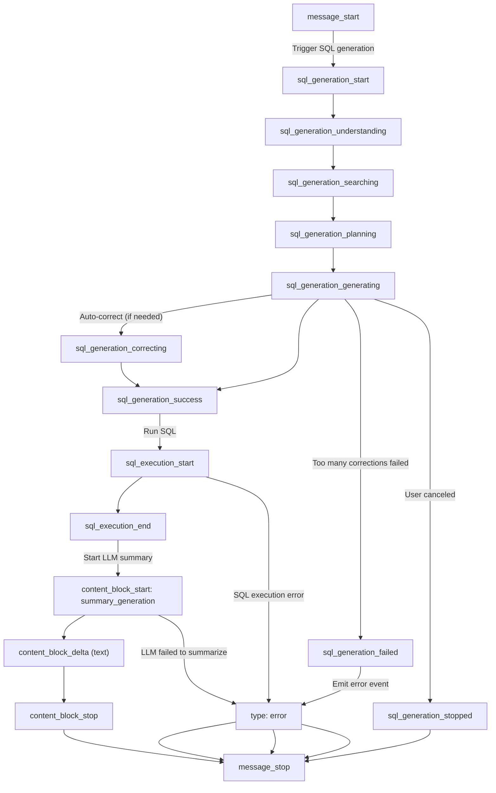
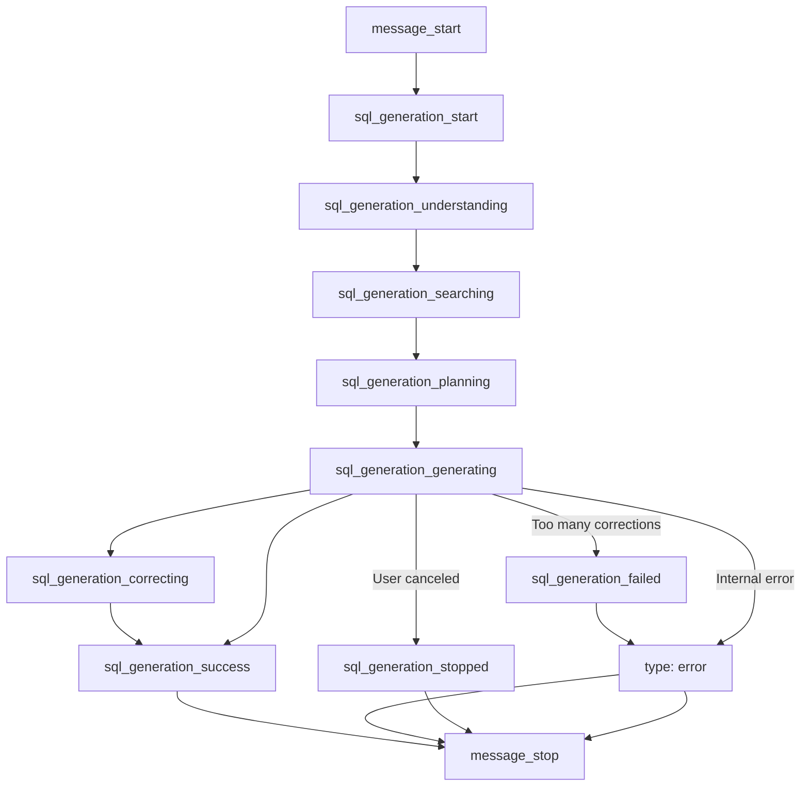

# 查询与问答 (Query & Answering)

Wren AI 提供了一个强大的 Text-to-SQL 接口，允许用户使用自然语言直接查询数据库。

Wren AI 暴露了一系列核心 API 来解答用户的问题，包括：将问题转化为 SQL、执行查询、解释查询结果以及生成自然语言总结。

## 接口概览 (Endpoints Overview)

* `POST /ask`: 提问并直接获取 AI 的最终合并解答。
* `POST /generate_sql`: 将自然语言问题转化为 SQL 查询语句。
* `POST /run_sql`: 执行 SQL 语句并返回结构化数据结果。
* `POST /generate_summary`: 为执行完的 SQL 数据生成自然语言总结。
* `GET /stream_explanation`: 针对非 SQL 问题（如闲聊、通用问题）进行流式（SSE）文本原理解释。

使用这些 API 可以构建交互式、智能化的数据消费体验。

<br />

## 服务地址与认证鉴权 (Base URL & Authentication)

所有 API 请求都必须发送到网关的服务地址：

```
http://188.107.223.20:3000/
```

### 🔐 认证方式 (Authentication)

API 访问已启用系统的 API Key 认证与表级权限隔离机制。您必须在所有的请求头（Header）中携带有效密钥。系统支持以下两种认证请求头形式：

* **方式一（推荐）：标准 Bearer Header**
  * **Header 名称**：`Authorization`
  * **Header 数值**：`Bearer <YOUR_API_KEY>`（例如：`Bearer wren_sk_6506a06382255c417dbcb3013f8a2f2c4819f8d334a94714`）

* **方式二：自定义 Key Header**
  * **Header 名称**：`X-API-KEY`
  * **Header 数值**：`<YOUR_API_KEY>`（例如：`wren_sk_6506a06382255c417dbcb3013f8a2f2c4819f8d334a94714`）

#### 🔑 API Key 的申请与管理
管理员可在 Wren AI 控制台的 **Settings ➔ API Key Management** 页面统一管理密钥：
- 每个 API Key 可被分配针对特定数据表的访问权限（例如仅允许访问 `mysql.telecom_db.field_level_info`）或全表访问权限 (`*`)。
- 新建的 API Key 格式为以 `wren_sk_` 为前缀的 48 位安全随机字符串，创建时仅展示一次，请妥善保管。

#### ⚠️ 鉴权与权限拦截错误响应

1. **未提供密钥或密钥无效/已禁用（`401 Unauthorized`）**：
```json
{
  "id": "a1b2c3d4-e5f6-7890-abcd-ef1234567890",
  "error": "Invalid or inactive API Key"
}
```

2. **请求的数据表不在该 API Key 的授权范围内（`403 Forbidden`）**：
```json
{
  "id": "a1b2c3d4-e5f6-7890-abcd-ef1234567890",
  "error": "Requested tables are not authorized for this API Key"
}
```

### 🚦 速率限制与规范 (Rate Limiting & Restrictions)

为了保障服务的稳定性，API 网关实施了以下策略：

* **限流保护 (Rate Limit)**：单 IP 限制每秒最多 **15 个请求 (15 r/s)**，突发请求缓冲区（Burst）最多允许 **25 个请求**。
* **路径拦截 (Path Access)**：网关仅放行以 `/api/v1/` 或 `/api/graphql` 开头的请求路径。访问其他路径会直接返回 `403 Forbidden` 错误。
* **超时限制 (Timeout Limit)**：客户端连接超时及后端代理超时均已延长至 **300 秒（5 分钟）**，以支持耗时较长的问答和生成任务。

<br />

## 场景选型：我该使用哪个 API？

Wren AI 的 API 采用模块化设计。您可以选择使用“一站式” API，也可以将多个细分接口串联起来，以获得更高的灵活性与控制力。

### 🔹 简易问答场景（一站式）

适用于仅需要输入问题并直接获得最终结论的场景：

| 业务需求 | 适用接口 |
| :------------------------------------------------------------------------------------------ | :---------- |
| 我想提问并直接获得回答（AI 会自动生成 SQL、执行查询并生成数据总结） | /ask        |
| 我希望前端展示流式的推理过程和进度更新（类似 ChatGPT 的打字机和推理过程） | /stream/ask |

<br />

### 🔹 高级与模块化工作流

如果您需要对每一步进行精细控制（例如在 SQL 执行前进行人工审核或拦截）：

| 工作流步骤 | 对应 API |
| :----------------------------------------- | :--------------------------------------- |
| 将自然语言提问转换为 SQL | /generate\_sql 或 /stream/generate\_sql |
| 执行该 SQL 获取数据 | /run\_sql                                |
| 为该 SQL 结果生成自然语言总结 | /generate\_summary                       |
| 在问题无法转为 SQL 时获取详细文本解释 | /stream\_explanation                     |

<br />

### 💡 常见组合推荐

您可以根据产品需求混搭并串联这些接口。

* `/generate_sql` → `/run_sql` → `/generate_summary`

  适用于构建 **交互式 BI 工具** 或 **工作流系统**。在这种场景下，生成的 SQL 需要在执行前进行展示、人工修改、审计或记录。
* `/ask`

  最适用于简单的 **聊天对话框** 或 **快速问答**，开发成本极低。
* `/stream/ask`

  最适用于需要展示大模型思考和执行进度的现代 Web/移动端前端应用。

# /ask 接口

## 功能描述

将您的问题转换为 SQL，执行该 SQL，并提供针对该数据的分析洞察。

`/ask` 接口将 `/generate_sql` 和 `/generate_summary` 的功能融合到了一个智能的 API 中。

它允许用户使用自然语言进行提问。如果问题可以被转换为 SQL 查询，系统将自动进行以下操作：

1. 生成 SQL 语句
2. 在数据库中执行该 SQL
3. 用自然语言对查询结果进行总结分析

如果用户提问了与数据无关的问题（例如问候或通用产品功能问题），系统则直接返回一段文本解释。

> 💡 **想要更生动的交互体验？**
>
> 如果查询处理耗时较长，或者您希望用户能看到“后台发生的事情”，可以使用流式版本 (`/stream/ask`)。\
> 它会分步骤返回系统所处的阶段 —— 从理解意图、生成 SQL、执行查询到最终的数据总结。

<br />

## 基础用法 (Basic Usage)

### 请求参数说明 (Request Parameters)

| 参数名 | 类型 | 必填 | 描述说明 |
| :--- | :--- | :--- | :--- |
| `question` | `string` | 是 | 用户的自然语言提问文本。 |
| `tables` | `string[]` | 否 | 限制查询的数据库表名列表（须传入 `/models` 接口响应示例中对应的 `models[i].name` 字段）。若传入，AI 检索与 SQL 生成将仅限定在指定的表范围中。 |
| `threadId` | `string` | 否 | 上下文会话 ID，用于多轮连续追问。 |
| `sampleSize` | `number` | 否 | 生成数据总结时的最大采样行数。 |
| `language` | `string` | 否 | 指定 AI 返回总结与解释的语言（如 `"Chinese"`、`"English"`）。 |

```json Request
{
  "question": "List the top 5 states with the most customers",
  "tables": ["customers", "orders"]
}

```

```json Response
{
  "id": "a1b2c3d4-e5f6-7890-abcd-ef1234567890",
  "sql": "SELECT customer_state, COUNT(*) as customer_count FROM customers GROUP BY customer_state ORDER BY customer_count DESC LIMIT 5",
  "summary": "São Paulo (SP) leads with 15,847 customers, followed by Rio de Janeiro (RJ) and Minas Gerais (MG).",
  "threadId": "9c537507-9cec-46ed-b877-07bfa6322bed"
}

```

<br />

## 非 SQL 问题处理 (Non-SQL Query Handling)

当自然语言问题**无法转换为 SQL** 时，该接口会返回一段文本响应，解释系统目前可以提供哪些帮助。

例如：

```json Request
{
  "question": "你好"
}
```

```json Response
{  
  "id": "a1b2c3d4-e5f6-7890-abcd-ef1234567890",
  "type": "NON_SQL_QUERY",
  "explanation": "您好！我是您的数据助理，可以帮您解答有关数据库的问题。您可以问我类似于 '展示各产品的销售额' 这样的问题。"
}
```

这种情况通常发生在用户提问比较宽泛、模糊，或者与任何已知的数据库表或数据建模（MDL）无关时。

<br />

## 连续对话上下文 (Conversation Context)

您可以使用响应中返回的 `threadId` 进行追问，以便在保持对话上下文的同时继续提问：

```javascript
// Follow-up question
{
  "question": "List top 3 instead",
  "threadId": "9c537507-9cec-46ed-b877-07bfa6322bed"
}

// Response
{
  "id": "a1b2c3d4-e5f6-7890-abcd-ef1234567890",
  "sql": "SELECT customer_state, COUNT(*) as customer_count FROM customers GROUP BY customer_state ORDER BY customer_count DESC LIMIT 3",
  "summary": "...",
  "threadId": "9c537507-9cec-46ed-b877-07bfa6322bed"
}
```

<br />

## 错误处理 (Error handling)

常见错误代码 (Error Codes)：

* `NO_DEPLOYMENT_FOUND` – 当前项目没有处于激活状态的 MDL 建模部署。
* `POLLING_TIMEOUT` – 等待 AI 响应超时。
* `INVALID_SQL_ERROR` – 生成的 SQL 在数据库中执行失败（例如由于数据库表结构变更产生不匹配）。
* `INTERNAL_SERVER_ERROR` – 服务器内部发生未知错误。

### 错误示例：SQL 修正重试失败

当生成的 SQL 即使经过内部自动纠错尝试后仍然在执行时失败，API 将返回以下格式：

```json Invalid SQL Error
{
  "id": "34f7a6de-b9b8-4c2b-8c6a-ffecebb7b8a2",
  "code": "INVALID_SQL_ERROR",
  "error": "Column 'customer_namme' does not exist in table 'customers'",
  "invalidSql": "SELECT customer_namme FROM customers",
  "threadId": "9c537507-9cec-46ed-b877-07bfa6322bed"
}
```

* `error`: 数据库返回的原始错误信息。通常包含了具体的语法错误或表名、列名不存在的提示。
* `invalidSql`: 最终执行失败的 SQL 语句。

这些字段可以帮助您：

* 更高效地调试和定位问题
* 告知用户提问中的哪一部分可能需要做出调整
* 记录调用失败的日志以供后续分析报告

# /generate_sql 接口

## 功能描述

将自然语言问题转换为 SQL 查询。

`/generate_sql` 接口将自然语言提问转换为 SQL 查询语句，允许您使用自然语言与数据库进行交互。

> 📘 **何时使用此接口**
>
> * 您只想**将自然语言翻译为 SQL**，暂时不需要运行 SQL 或生成总结。
> * 您正在构建一个在**执行前**需要对 SQL 进行人工审核、修改或批准的工作流。
> * 您希望独立于其他步骤，单独对生成的 SQL 进行**调试或微调**。
> * 您希望将 SQL 生成与手动或自动执行（例如发送 SQL 到 `/run_sql` 或 `/generate_summary`）进行链式调用。
>
> 如果需要一站式体验（问题 → SQL → 结果 → 总结），请改用 `/ask` 接口。

## 基础用法 (Basic Usage)

### 请求参数说明 (Request Parameters)

| 参数名 | 类型 | 必填 | 描述说明 |
| :--- | :--- | :--- | :--- |
| `question` | `string` | 是 | 用户的自然语言提问文本。 |
| `tables` | `string[]` | 否 | 限制查询的数据库表名列表（须传入 `/models` 接口响应示例中对应的 `models[i].name` 字段）。若传入，AI 检索与 SQL 生成将仅限定在指定的表范围中。 |
| `threadId` | `string` | 否 | 上下文会话 ID，用于多轮连续追问。 |
| `language` | `string` | 否 | 指定 AI 返回推导逻辑与错误响应的语言。 |
| `returnSqlDialect` | `boolean` | 否 | 是否返回底层数据库的原生 SQL 方言（默认为 `false`）。 |

要生成 SQL 查询，请发送包含您提问的请求：

```javascript
// Request
{
  "question": "Show me all customers",
  "tables": ["customers"]
}

// Response
{
  "id": "1fbc0d64-1c58-45b2-a990-9183bbbcf913",
  "sql": "SELECT * FROM \"olist_customers_dataset\"",
  "threadId": "9c537507-9cec-46ed-b877-07bfa6322bed"
}
```

<br />

## 连续对话上下文 (Conversation Context)

您可以使用响应中返回的 `threadId` 进行追问，以便在保持对话上下文的同时继续提问：

```javascript
// Follow-up question
{
  "question": "list top 10 only",
  "threadId": "9c537507-9cec-46ed-b877-07bfa6322bed"
}

// Response
{
  "id": "2589615b-abbd-48b0-926f-128faa96a87e",
  "sql": "SELECT * FROM \"olist_customers_dataset\" ORDER BY \"customer_id\" ASC LIMIT 10",
  "threadId": "9c537507-9cec-46ed-b877-07bfa6322bed"
}
```

<br />

## 执行查询 (Executing Queries)

获取到 SQL 后，您可以：

* 将该 SQL 传递给 `/run_sql` 接口以执行查询并获取结果。
* 使用 `returnSqlDialect: true` 参数来获取数据库原生方言的 SQL，并在您的数据库中直接运行它。

## 非 SQL 问题处理 (Non-SQL Query Handling)

如果您的问题无法转换为 SQL，您将收到一个包含以下字段的错误响应：

* `id`：错误响应的唯一标识符。
* `code`：表明所遇问题类型的错误代码：
  * `NON_SQL_QUERY`：问题无法被转换为 SQL，因为它与数据查询无关。
  * `NO_DEPLOYMENT_FOUND`：未找到该项目处于激活状态的部署。
  * `POLLING_TIMEOUT`：在等待 AI 服务响应时操作超时。
* `error`：用人类可读的文字描述为什么查询无法转换为 SQL。
* `explanationQueryId`：一个可以用来获取更详细解释的标识符。

```javascript
// 示例 1: 提问 "hello"
{
  "id": "e593369b-e222-4435-b874-dc10edb12a96",
  "code": "NON_SQL_QUERY",
  "error": "Vague greeting unrelated to schema, SQL, or user guide; no specific intent identified.",
  "explanationQueryId": "475afc1f-7950-4bc7-a248-a7da394d137a"
}

// 示例 2: 提问 "what could you do"
{
  "id": "75c13d09-6f86-4e79-a00e-a4f85f73f2d7",
  "code": "NON_SQL_QUERY",
  "error": "User asks about Wren AI's features and capabilities, unrelated to database schema.",
  "explanationQueryId": "71b016c5-42bb-4897-82d6-46f9b0bf7d94"
}
```

您可以将 `explanationQueryId` 传递给 `/stream_explanation` 接口，以便以事件流（SSE）的形式接收详细的解释响应。

# /run_sql 接口

## 功能描述

执行 SQL 查询，并将结果作为结构化数据返回。

`/run_sql` 接口在您的数据库中执行 SQL 查询，并将查询结果作为结构化数据返回。此接口可用于运行由 `/generate_sql` 接口生成的 SQL 查询，或运行您手动编写的自定义 SQL 查询。

## 基础用法 (Basic Usage)

```javascript
// Request
{
  "sql": "SELECT * FROM \"olist_customers_dataset\" LIMIT 10"
}

// Response
{
  "id": "09d46224-0068-4ca3-bce4-f1fc85093eb6",
  "records": [
    {
      "customer_id": "00012a2ce6f8dcda20d059ce98491703",
      "customer_unique_id": "248ffe10d632bebe4f7267f1f44844c9",
      "customer_zip_code_prefix": "06273",
      "customer_city": "osasco",
      "customer_state": "SP"
    },
    {
      "customer_id": "000161a058600d5901f007fab4c27140",
      "customer_unique_id": "b0015e09bb4b6e47c52844fab5fb6638",
      "customer_zip_code_prefix": "35550",
      "customer_city": "itapecerica",
      "customer_state": "MG"
    },
    "... additional records ..."
  ],
  "columns": [
    {
      "name": "customer_id",
      "type": "VARCHAR"
    },
    {
      "name": "customer_unique_id",
      "type": "VARCHAR"
    },
    {
      "name": "customer_zip_code_prefix",
      "type": "VARCHAR"
    },
    {
      "name": "customer_city",
      "type": "VARCHAR"
    },
    {
      "name": "customer_state",
      "type": "VARCHAR"
    }
  ],
  "threadId": "503a8ca5-8171-43b5-b45b-86de2849467b",
  "totalRows": 10
}
```

<br />

## 错误处理 (Error Handling)

```javascript
{
  "id": "6fb82c31-a40d-4b8e-9e5f-c1d8a742db76",
  "code": "DATABASE_ERROR",
  "error": "Error executing SQL: Table 'nonexistent_table' doesn't exist"
}
```

错误代码可能包括：

* `DATABASE_ERROR`：执行 SQL 查询时发生数据库错误。
* `INVALID_SQL`：SQL 语法无效。
* `NO_DEPLOYMENT_FOUND`：未找到有效的数据库连接或部署。

## 典型工作流示例 (Workflow Example)

1. 使用 `/generate_sql` 接口生成 SQL。
2. 将生成的 SQL 传递给 `/run_sql` 执行并获取结果。
3. 可选择在后续查询中复用相同的 `threadId` 以保持对话上下文。

# /generate_summary 接口

## 功能描述

基于 SQL 查询和自然语言问题生成自然语言数据总结。

`/generate_summary` 接口接收用户的自然语言提问与对应的 SQL 查询语句，在后端执行该 SQL 后，基于查询到的数据集样本生成一份容易被人类理解的自然语言文本总结。

它通常用于在您已经拥有或生成了 SQL 查询语句，但希望为返回的数据结果提供一段友好且易读的解释的场景。

> 📘 **何时使用此接口**
>
> * 您已经编写或生成了 SQL，且希望获得针对执行结果的自然语言简报。
> * 您希望在仪表板（Dashboard）、聊天界面或自动化报告中提供对数据的用户友好型文字解释。
> * 在对原始 SQL 执行完毕后，需要进行后期的数据汇总生成。
>
> 如果需要进行全链路流转（问题 → SQL → 结果 → 总结），请直接使用 `/ask` 接口。

## 工作原理 (How it works)

* 您提供原始的自然语言问题以及已执行的 SQL。
* 系统执行该查询，获取结果的样本（默认前 `500` 行数据），并基于此生成自然语言回答。
* 您可以自定义采样条数限制（`sampleSize`）和回复的语言（`language`）。

<br />

## 基础用法 (Basic usage)

```json Request
{
  "question": "List the top 5 states with the most customers",
  "sql": "SELECT customer_state, COUNT(*) as customer_count FROM customers GROUP BY customer_state ORDER BY customer_count DESC LIMIT 5"
}
```

```json Response
{
  "id": "b2c3d4e5-f6g7-8901-bcde-f23456789012",
  "summary": "São Paulo (SP) leads with 15,847 customers, followed by Rio de Janeiro (RJ) and Minas Gerais (MG). These top 3 states account for over 50% of the customer base.",
  "threadId": "9c537507-9cec-46ed-b877-07bfa6322bed"
}
```

<br />

## 错误处理 (Error handling)

常见错误代码 (Error Codes)：

* `NO_DEPLOYMENT_FOUND` – 当前项目没有处于激活状态的 MDL 建模部署。
* `POLLING_TIMEOUT` – 等待 AI 响应超时。
* `INVALID_SQL_ERROR` – 生成的 SQL 在数据库中执行失败（例如由于数据库表结构变更产生不匹配）。
* `INTERNAL_SERVER_ERROR` – 服务器内部发生未知错误。

# /stream_explanation 接口

## 功能描述

使用服务器发送事件 (SSE) 流式传输针对非 SQL 问题的解释文本。

`/stream_explanation` 接口通过服务器发送事件（Server-Sent Events，即 SSE）提供对非 SQL 查询的详细文本解释。当用户的自然语言问题无法被转换为 SQL 时，此接口可以传递一个流式的文本响应，说明系统目前可以帮助用户做什么。

## 基础用法 (Basic Usage)

若要接收流式解释，请在请求中使用之前调用 `/generate_sql` 时返回 `NON_SQL_QUERY` 错误中的 `explanationQueryId`：

## 响应格式 (Response Format)

响应格式为 `text/event-stream`，其中每个事件包含一个 JSON 消息。内容将以小分片（Chunk）形式流式传递，以提供快速响应的交互体验：

```javascript
data: {"message":"Wren AI is "}

data: {"message":"designed to "}

data: {"message":"help you analyze "}

data: {"message":"your data with "}

data: {"message":"natural language queries. I can "}

data: {"message":"provide insights about "}

data: {"message":"your business data and "}

data: {"message":"create visualizations."}

data: {"done":true}
```

<br />

## 客户端处理 (Client-Side Handling)

在前端消费此数据流时：

1. 将每个事件的 `data` 部分解析为 JSON。
2. 针对包含 `message` 属性的消息：
   * 将文本追加到您的 UI 界面上。
   * 在收到碎片数据时，以增量方式更新您的界面。
3. 当您收到 `{"done":true}` 时，代表解释文本流传输已完成。

<br />

## 错误处理 (Error Handling)

如果数据流发生失败或 query ID 无效，您将收到一个 `500` 状态码以及相应的错误信息。

常见的错误类型包括：

* 无效的查询 ID (`queryId`)
* 解释文本已过期（解释文本缓存可能在一定时间段后失效）
* 服务器处理异常

请务必实现错误处理机制，以优雅地应对网络连接中断或无效请求。

# 图表生成 (Chart generation)

Wren AI 提供了强大的数据可视化功能，可以通过简单的 API 接口将您的数据转换为极具洞察力的图表。您可以直接基于自然语言问题和对应的 SQL 查询生成美观、交互式的 **Vega-Lite** 图表配置。

## 接口概览 (Endpoint Overview)

* `POST /generate_vega_chart`：生成完整的 Vega-Lite 图表渲染规范（Spec），且数据会自动嵌入在配置中以便于前端渲染。

## 图表生成工作流 (Chart Generation Workflow)

图表生成过程遵循一个简单的流水线：

1. 通过 `/generate_sql` 接口提问以获得 SQL。
2. 将您的问题与该 SQL 共同发送至 `/generate_vega_chart` 请求生成可视化 spec。
3. 在您的应用前端，使用 Vega 库渲染返回的图表 specification。

# /generate_vega_chart 接口

## 功能描述

基于自然语言提问与 SQL 查询生成用于数据可视化的 Vega 图表 spec。

`/generate_vega_chart` 接口会分析您的问题与数据特征，进而生成一份最优的可视化渲染规范。它会根据您的数据集特征与提问意图，智能选择适合的图表类型、色彩搭配以及页面布局。

## 核心特性 (Key Features)

* **图表类型自动优选**：根据您的数据结构特征自动选择最适合的可视化图表类型（如柱状图、折线图等）。
* **内联数据嵌入**：查询结果数据会直接作为 `values` 内联包含在 spec 中，拿到即可在前端直接渲染。

## 示例

响应将是一个可以使用 Vega 库进行渲染的 Vega 配置规范 (Vega Spec)。例如：

```javascript
{
  "question": "Show me total payments by customer state",
  "sql": "SELECT customer_state, SUM(payment_value) AS total_payment_value FROM orders GROUP BY customer_state ORDER BY total_payment_value DESC",
  "threadId": "75ab23c8-9124-4560-a125-fbe7e321dcba"
}
```

Response:

```javascript
{
    "id": "a9597146-03ee-4de7-bcd6-57d71bffe86a",
    "vegaSpec": {
        "$schema": "https://vega.github.io/schema/vega-lite/v5.json",
        "config": {
            "mark": {
                "tooltip": true
            },
            "font": "Roboto, Arial, Noto Sans, sans-serif",
            "padding": {
                "top": 30,
                "bottom": 20,
                "left": 0,
                "right": 0
            },
            "title": {
                "color": "#262626",
                "fontSize": 14
            },
            "axis": {
                "labelPadding": 0,
                "labelOffset": 0,
                "labelFontSize": 10,
                "gridColor": "#d9d9d9",
                "titleColor": "#434343",
                "labelColor": "#65676c",
                "labelFont": " Roboto, Arial, Noto Sans, sans-serif"
            },
            "axisX": {
                "labelAngle": -45
            },
            "line": {
                "color": "#1570EF"
            },
            "bar": {
                "color": "#1570EF"
            },
            "legend": {
                "symbolLimit": 15,
                "columns": 1,
                "labelFontSize": 10,
                "labelColor": "#65676c",
                "titleColor": "#434343",
                "titleFontSize": 14
            },
            "range": {
                "category": [
                    "#7763CF",
                    "#444CE7",
                    "#1570EF",
                    "#0086C9",
                    "#3E4784",
                    "#E31B54",
                    "#EC4A0A",
                    "#EF8D0C",
                    "#EBC405",
                    "#5381AD"
                ],
                "ordinal": [
                    "#7763CF",
                    "#444CE7",
                    "#1570EF",
                    "#0086C9",
                    "#3E4784",
                    "#E31B54",
                    "#EC4A0A",
                    "#EF8D0C",
                    "#EBC405",
                    "#5381AD"
                ],
                "diverging": [
                    "#7763CF",
                    "#444CE7",
                    "#1570EF",
                    "#0086C9",
                    "#3E4784",
                    "#E31B54",
                    "#EC4A0A",
                    "#EF8D0C",
                    "#EBC405",
                    "#5381AD"
                ],
                "symbol": [
                    "#7763CF",
                    "#444CE7",
                    "#1570EF",
                    "#0086C9",
                    "#3E4784",
                    "#E31B54",
                    "#EC4A0A",
                    "#EF8D0C",
                    "#EBC405",
                    "#5381AD"
                ],
                "heatmap": [
                    "#7763CF",
                    "#444CE7",
                    "#1570EF",
                    "#0086C9",
                    "#3E4784",
                    "#E31B54",
                    "#EC4A0A",
                    "#EF8D0C",
                    "#EBC405",
                    "#5381AD"
                ],
                "ramp": [
                    "#7763CF",
                    "#444CE7",
                    "#1570EF",
                    "#0086C9",
                    "#3E4784",
                    "#E31B54",
                    "#EC4A0A",
                    "#EF8D0C",
                    "#EBC405",
                    "#5381AD"
                ]
            },
            "point": {
                "size": 60,
                "color": "#1570EF"
            }
        },
        "title": "Total Payments by Customer State",
        "data": {
            "values": [
                {
                    "customer_state": "PR",
                    "total_payment_value": 811156.379999998
                },
                {
                    "customer_state": "BA",
                    "total_payment_value": 616645.8200000012
                },
                {
                    "customer_state": "RJ",
                    "total_payment_value": 2144379.68999999
                },
                {
                    "customer_state": "SE",
                    "total_payment_value": 75246.25
                },
                {
                    "customer_state": "TO",
                    "total_payment_value": 61485.32999999993
                },
                {
                    "customer_state": "AP",
                    "total_payment_value": 16262.8
                },
                {
                    "customer_state": "SC",
                    "total_payment_value": 623086.43
                },
                {
                    "customer_state": "PA",
                    "total_payment_value": 218295.85
                },
                {
                    "customer_state": "MT",
                    "total_payment_value": 187029.28999999986
                },
                {
                    "customer_state": "AL",
                    "total_payment_value": 96962.06000000003
                },
                {
                    "customer_state": "RN",
                    "total_payment_value": 102718.13
                },
                {
                    "customer_state": "AC",
                    "total_payment_value": 19680.62
                },
                {
                    "customer_state": "GO",
                    "total_payment_value": 350092.3100000009
                },
                {
                    "customer_state": "ES",
                    "total_payment_value": 325967.55000000045
                },
                {
                    "customer_state": "AM",
                    "total_payment_value": 27966.93
                },
                {
                    "customer_state": "MS",
                    "total_payment_value": 137534.84000000003
                },
                {
                    "customer_state": "RR",
                    "total_payment_value": 10064.62
                },
                {
                    "customer_state": "PI",
                    "total_payment_value": 108523.97000000003
                },
                {
                    "customer_state": "SP",
                    "total_payment_value": 5998226.959999885
                },
                {
                    "customer_state": "MG",
                    "total_payment_value": 1872257.2600000093
                },
                {
                    "customer_state": "DF",
                    "total_payment_value": 355141.0799999998
                },
                {
                    "customer_state": "MA",
                    "total_payment_value": 152523.02000000002
                },
                {
                    "customer_state": "RS",
                    "total_payment_value": 890898.5399999967
                },
                {
                    "customer_state": "CE",
                    "total_payment_value": 279464.0300000001
                },
                {
                    "customer_state": "PE",
                    "total_payment_value": 324850.4399999999
                },
                {
                    "customer_state": "PB",
                    "total_payment_value": 141545.7199999999
                },
                {
                    "customer_state": "RO",
                    "total_payment_value": 60866.2
                }
            ]
        },
        "mark": {
            "type": "bar"
        },
        "width": "container",
        "height": "container",
        "autosize": {
            "type": "fit",
            "contains": "padding"
        },
        "encoding": {
            "x": {
                "field": "customer_state",
                "type": "nominal",
                "title": "Customer State"
            },
            "y": {
                "field": "total_payment_value",
                "type": "quantitative",
                "title": "Total Payment Value"
            },
            "color": {
                "field": "customer_state",
                "type": "nominal",
                "title": "Customer State",
                "scale": {
                    "range": [
                        "#7763CF",
                        "#444CE7",
                        "#1570EF",
                        "#0086C9",
                        "#3E4784",
                        "#E31B54",
                        "#EC4A0A",
                        "#EF8D0C",
                        "#EBC405",
                        "#5381AD"
                    ]
                }
            },
            "opacity": {
                "condition": {
                    "param": "hover",
                    "value": 1
                },
                "value": 0.3
            }
        },
        "params": [
            {
                "name": "hover",
                "select": {
                    "type": "point",
                    "on": "mouseover",
                    "clear": "mouseout",
                    "fields": [
                        "customer_state"
                    ]
                }
            }
        ]
    },
    "threadId": "bfbef4db-5bb4-4133-a65f-9dd813569727"
}
```

试着将此规范（spec）复制到 Vega Editor 中，您就可以看到如下生成的图表：

<Image align="center" src="https://files.readme.io/6ea405f17e0354592da2f35e87bbc5eaeb19cffd8fc1b45b9c3c61aaede2a053-Screenshot_2025-04-25_at_7.57.40_PM.png" />

## 错误处理 (Error Handling)

如果图表生成失败，您将收到如下格式的错误响应：

```javascript
{
  "id": "c4f82c31-a40d-4b8e-9e5f-c1d8a742db55",
  "code": "INVALID_SQL",
  "error": "Unable to generate chart: SQL query does not return valid data for visualization"
}
```

<br />

## 支持的图表类型 (Supported Chart Types)

请查阅 [Wren AI / Generate Chart](https://docs.getwren.ai/oss/guide/home/chart#supported-chart-types) 作为开发参考。

# 流式传输 (Streaming)

在 Wren AI 处理您的请求时，实时接收过程更新。

流式传输 API 允许您在 Wren AI 处理您的请求时实时接收状态更新 —— 包括理解问题、生成 SQL、运行查询，并可选地返回最终总结。

这些接口使用 **服务器发送事件 (Server-Sent Events，即 SSE)** 来投递一连串连续的结构化事件。这非常适用于诸如聊天对话框、Notebook 或数据看板等交互式应用，让用户能从逐步的过程反馈中受益。

***

## 使用场景 (Use Cases)

* ✅ 在聊天机器人中实时展示 AI 的推理逻辑与 SQL 生成进度
* ✅ 实时展现 SQL 的执行进度状态
* ✅ 实时渲染流式的总结文本（打字机效果）
* ✅ 通过展示中间处理步骤，降低用户感知的等待延迟

***

## 可用的流式接口 (Available Streaming Endpoints)

| 接口路径 | 描述说明 |
| --------------------------- | ---------------------------------------------------------------- |
| `POST /stream/ask`          | 完整链路流式传输：自动生成 SQL、执行查询并生成数据总结 |
| `POST /stream/generate_sql` | 仅在生成 SQL 的过程中进行流式传输，不运行 SQL，也不生成总结 |

# /stream/ask 接口

## 功能描述

实时流式传输“问答（ask）”流程的状态更新与内容生成。

`POST /stream/ask` 接口允许您提交一个自然语言问题，并在 AI 处理该请求的各个环节（包括 SQL 生成、执行和总结创建）中，实时接收逐步的过程状态更新。

这是 `/ask` 接口的流式版本，非常适用于需要向用户展示实时处理进度的前端应用（如聊天机器人）。

## 核心机理 (What It Does)

该接口返回一个 **服务器发送事件 (SSE)** 流，包含以下内容：

1. 关于各个处理阶段的系统消息（例如：SQL 生成开始、执行完毕等）。
2. 最终的产出物，如生成的 SQL 语句和自然语言数据总结。
3. 中间的推理过程解释，如重组后的问题（Rephrased Question）和推理规划路径。

<br />

## 基础用法 (Basic Usage)

### 请求参数说明 (Request Parameters)

| 参数名 | 类型 | 必填 | 描述说明 |
| :--- | :--- | :--- | :--- |
| `question` | `string` | 是 | 用户的自然语言提问文本。 |
| `tables` | `string[]` | 否 | 限制查询的数据库表名列表（须传入 `/models` 接口响应示例中对应的 `models[i].name` 字段）。若传入，AI 检索与 SQL 生成将仅限定在指定的表范围中。 |
| `threadId` | `string` | 否 | 上下文会话 ID，用于多轮连续追问。 |
| `sampleSize` | `number` | 否 | 生成数据总结时的最大采样行数。 |
| `language` | `string` | 否 | 指定 AI 流式输出与解释的语言。 |

```json Request
{
  "question": "列出客户数量最多的前 5 个省份",
  "tables": ["customers"]
}
```

以下这个简化后的事件流展示了 `/stream/ask` 请求的关键核心阶段 —— 从理解提问、生成 SQL，到执行查询并最终流式输出总结内容：

```json Response
// Stream begins
data: { "type": "message_start" }

// SQL Generation Stages
data: { "type": "state", "data": { "state": "sql_generation_start" }}
data: { "type": "state", "data": { "state": "sql_generation_understanding" }}
data: { "type": "state", "data": { "state": "sql_generation_searching" }}
data: { "type": "state", "data": { "state": "sql_generation_planning" }}
data: { "type": "state", "data": { "state": "sql_generation_generating" }}
data: { "type": "state", "data": { "state": "sql_generation_success", "sql": "SELECT ... LIMIT 5" }}

// SQL Execution
data: { "type": "state", "data": { "state": "sql_execution_start" }}
data: { "type": "state", "data": { "state": "sql_execution_end" }}

// Summary Generation (streamed content block)
data: { "type": "content_block_start", "content_block": { "type": "text", "name": "summary_generation" }}
data: { "type": "content_block_delta", "delta": { "text": "Here" }}
data: { "type": "content_block_delta", "delta": { "text": " are" }}
data: { "type": "content_block_delta", "delta": { "text": " the first 5 customers from the dataset." }}
data: { "type": "content_block_stop" }

// Stream ends
data: { "type": "message_stop" }

```

> **说明**：此示例为了简洁易读，**省略了部分详细的属性**（如原始提问 `question`、重组问题 `rephrasedQuestion`、提问意图推理 `intentReasoning`、调试标识 `traceId` 以及时间戳 `timestamp`）。请参考完整的 OpenAPI schema 以查看所有可用字段的详细拆解。

<br />

## 状态生命周期 (State Lifecycle)



<br />

## 事件类型 (Event Types)

在 `/stream/ask` 请求的过程中，API 会使用 **服务器发送事件 (SSE)** 推送一系列事件。每个事件都展示了系统当前所处的处理状态或阶段性输出。

### message\_start

* **用途**：表明一个新的流式响应正式开始。
* **Payload（负载）**：包含流程启动时的 Unix 时间戳。

```json Example
{
  "type": "message_start",
  "timestamp": 1751014954139
}
```

<br />

### state

* **用途**：描述系统在整个处理流程中所处的具体状态。

#### 状态生命周期总览 (State Lifecycle Overview)

| `state` 状态值 | 描述说明 |
| ------------------------------ | -------------------------------------------------------------------------------------------- |
| `sql_generation_start`         | 系统已开始处理用户的自然语言问题。 |
| `sql_generation_understanding` | AI 正在理解用户提出的问题，并尝试识别其真实提问意图。 |
| `sql_generation_searching`     | AI 正在检索与当前问题相关的数据库表和元数据定义。 |
| `sql_generation_planning`      | 正在构建 SQL 生成的执行规划（例如决定进行哪些表关联或应用哪些过滤条件）。 |
| `sql_generation_generating`    | 正在基于模型和执行规则生成具体的 SQL 语句。 |
| `sql_generation_correcting`    | 生成的 SQL 在试运行时发生错误，网关正在自动进行 SQL 修正与优化（自动重试机制）。 |
| `sql_generation_success`       | SQL 成功生成。事件数据中会附带 `sql` 字段。 |
| `sql_generation_failed`        | SQL 生成最终宣告失败，随后会推送对应的 `error` 报错事件。 |
| `sql_generation_stopped`       | SQL 生成被手动取消或被动异常中断（例如客户端主动断开连接）。 |
| `sql_generation_finished`      | SQL 生成阶段完成（内部状态，通常随后会过渡到 `success` 或 `failed`）。 |
| `sql_execution_start`          | SQL 语句在底层数据库中开始执行。 |
| `sql_execution_end`            | SQL 执行完毕（无论执行成功还是失败）。 |

<br />

#### `"type": "state"` 内 Jun 字段参考说明

🔹 sql\_generation\_start

| 字段名 | 类型 | 描述说明 |
| ---------- | -------- | ---------------------------------------------------- |
| `state`    | `string` | 固定值为 `"sql_generation_start"`。 |
| `question` | `string` | 原始用户的自然语言输入。 |
| `threadId` | `string` | 会话的唯一 ID 标识。 |
| `language` | `string` | 用于生成最终总结的语言（如 `"English"` 或 `"Chinese"`）。 |

<br />

🔹 SQL 生成进行中状态 (In-Progress States)\
（如：sql\_generation\_understanding, searching, planning, generating, correcting）

| 字段名 | 类型 | 描述说明 |
| ------------------------ | -------------------- | ------------------------------------------------------------------------------------------------- |
| `state`                  | `string`             | 当前的生成状态，如 `"sql_generation_searching"`、`"sql_generation_planning"` 等。 |
| `pollCount`              | `number`             | 迄今为止的轮询尝试次数。 |
| `rephrasedQuestion`      | `string` \| `null`   | 重组和改写后的用户提问。 |
| `intentReasoning`        | `string` \| `null`   | AI 对用户真实提问意图的理解。 |
| `sqlGenerationReasoning` | `string` \| `null`   | SQL 生成的逐步推理逻辑（在 `generating` 状态下产生）。 |
| `retrievedTables`        | `string[]` \| `null` | 判定为与当前问题相关的数据库表名列表。 |
| `invalidSql`             | `string` \| `null`   | 在纠错修正尝试中失败的 SQL（可选）。 |
| `traceId`                | `string`             | 后端调试所用的 Trace ID 标识。 |

<br />

🔹 sql\_generation\_success

| 字段名 | 类型 | 描述说明 |
| ------- | -------------------------- | --------------------------------------- |
| `state` | `"sql_generation_success"` | 标志着 SQL 成功生成的阶段完成。 |
| `sql`   | `string`                   | 生成的最终 SQL 查询语句。 |

<br />

🔹 sql\_execution\_start

| 字段名 | 类型 | 描述说明 |
| ------- | ----------------------- | ----------------------------- |
| `state` | `"sql_execution_start"` | 数据库执行阶段开始。 |
| `sql`   | `string`                | 正在底层执行的 SQL 语句。 |

<br />

🔹 sql\_execution\_end

| 字段名 | 类型 | 描述说明 |
| ------- | --------------------- | ---------------------------------------------- |
| `state` | `"sql_execution_end"` | SQL 执行阶段已完成。无额外描述字段。 |

<br />

#### Example

```javascript Example
data: {
  "type": "state",
  "data": {
    "state": "sql_generation_start",
    "question": "list 5 customers",
    "threadId": "0625991d-1bba-407d-8ad4-dd0210172484",
    "language": "English"
  },
  "timestamp": 1751014954142
}

data: {
  "type": "state",
  "data": {
    "state": "sql_generation_understanding",
    "pollCount": 1,
    "rephrasedQuestion": null,
    "intentReasoning": null,
    "sqlGenerationReasoning": null,
    "retrievedTables": null,
    "invalidSql": null,
    "traceId": "f218b1f7-4623-4a56-8b66-18d544797b20"
  },
  "timestamp": 1751014954165
}

data: {
  "type": "state",
  "data": {
    "state": "sql_generation_searching",
    "pollCount": 4,
    "rephrasedQuestion": "List 5 customers from the olist_customers_dataset table.",
    "intentReasoning": "User wants to retrieve specific customer data, likely using SQL query.",
    "sqlGenerationReasoning": null,
    "retrievedTables": null,
    "invalidSql": null,
    "traceId": "f218b1f7-4623-4a56-8b66-18d544797b20"
  },
  "timestamp": 1751014957183
}

data: {
  "type": "state",
  "data": {
    "state": "sql_generation_planning",
    "pollCount": 6,
    "rephrasedQuestion": "List 5 customers from the olist_customers_dataset table.",
    "intentReasoning": "User wants to retrieve specific customer data, likely using SQL query.",
    "sqlGenerationReasoning": null,
    "retrievedTables": ["olist_customers_dataset"],
    "invalidSql": null,
    "traceId": "f218b1f7-4623-4a56-8b66-18d544797b20"
  },
  "timestamp": 1751014959232
}

data: {
  "type": "state",
  "data": {
    "state": "sql_generation_generating",
    "pollCount": 9,
    "rephrasedQuestion": "List 5 customers from the olist_customers_dataset table.",
    "intentReasoning": "User wants to retrieve specific customer data, likely using SQL query.",
    "sqlGenerationReasoning": "1. **Identify the table involved**: The question asks for customer data, so the relevant table is `olist_customers_dataset`.\n\n2. **Determine the number of records needed**: The user requests 5 customers, so we need to select 5 entries from the table.",
    "retrievedTables": ["olist_customers_dataset"],
    "invalidSql": null,
    "traceId": "f218b1f7-4623-4a56-8b66-18d544797b20"
  },
  "timestamp": 1751014962254
}

data: {
  "type": "state",
  "data": {
    "state": "sql_generation_success",
    "sql": "SELECT \"o\".\"customer_id\", \"o\".\"customer_zip_code_prefix\", \"o\".\"customer_city\", \"o\".\"customer_state\" FROM \"olist_customers_dataset\" AS \"o\" LIMIT 5"
  },
  "timestamp": 1751014963263
}

data: {
  "type": "state",
  "data": {
    "state": "sql_execution_start",
    "sql": "SELECT \"o\".\"customer_id\", \"o\".\"customer_zip_code_prefix\", \"o\".\"customer_city\", \"o\".\"customer_state\" FROM \"olist_customers_dataset\" AS \"o\" LIMIT 5"
  },
  "timestamp": 1751014963263
}

data: {
  "type": "state",
  "data": {
    "state": "sql_execution_end"
  },
  "timestamp": 1751014963339
}

```

<br />

### content\_block\_start

* **用途**：标志着一个新的内容块（例如数据总结生成）的开始。
* **Payload（负载）**：描述该内容块的类型（通常为 `text` 文本类型）。

```json Example
{
  "type": "content_block_start",
  "content_block": {
    "type": "text",
    "name": "summary_generation"
  }
}
```

<br />

### content\_block\_delta

* **用途**：分片流式推送实际的生成内容（例如总结文本的字词或句子碎片）。
* **Payload（负载）**：包含部分增量内容的 `text_delta`。

```json Example
{
  "type": "content_block_delta",
  "delta": {
    "type": "text_delta",
    "text": "São Paulo (SP) leads with"
  }
}
```

<br />

### content\_block\_stop

* **用途**：标志着当前流式内容块的结束。

```json Example
{
  "type": "content_block_stop"
}
```

<br />

### message\_stop

* **用途**：标志着整个事件流的彻底结束。包含总的处理耗时 `duration` 和会话 `threadId`。

```json Example
{
  "type": "message_stop",
  "data": {
    "threadId": "0625991d-1bba-407d-8ad4-dd0210172484",
    "duration": 11096
  }
}
```

# /stream/generate_sql 接口

## 功能描述

实时流式传输 SQL 生成过程中的状态更新。

`POST /stream/generate_sql` 接口允许您基于自然语言提问生成 SQL，并在整个 SQL 生成过程中接收**逐步的流式更新**。

这是 `/generate_sql` 接口的流式版本，专为需要实时呈现 SQL 生成每个阶段的交互式 UI 和调试工具而设计。

<br />

## 核心机理 (What It Does)

该接口返回一个 **服务器发送事件 (SSE)** 流，包含以下内容：

1. 处理状态信息（理解意图 → 检索表信息 → 规划路径 → 正在生成）。
2. 推理步骤与可追溯的上下文（Reasoning steps & Traceable context）。
3. 最终的 SQL 输出 —— 或者若生成失败则输出 error。

与 `/stream/ask` 不同，此接口**仅生成 SQL**，**不会运行 SQL，也不会生成数据总结**。

<br />

## 基础用法 (Basic Usage)

### 请求参数说明 (Request Parameters)

| 参数名 | 类型 | 必填 | 描述说明 |
| :--- | :--- | :--- | :--- |
| `question` | `string` | 是 | 用户的自然语言提问文本。 |
| `tables` | `string[]` | 否 | 限制查询的数据库表名列表（须传入 `/models` 接口响应示例中对应的 `models[i].name` 字段）。若传入，AI 检索与 SQL 生成将仅限定在指定的表范围中。 |
| `threadId` | `string` | 否 | 上下文会话 ID，用于多轮连续追问。 |
| `language` | `string` | 否 | 指定 AI 流式输出与解释的语言。 |

```json Request
{
  "question": "List the top 5 states with the most customers",
  "tables": ["customers"]
}
```

```json Response
// Stream begins
data: { "type": "message_start" }

data: {
  "type": "state",
  "data": { "state": "sql_generation_start" }
}
data: {
  "type": "state",
  "data": { "state": "sql_generation_understanding" }
}
data: {
  "type": "state",
  "data": { "state": "sql_generation_searching" }
}
data: {
  "type": "state",
  "data": { "state": "sql_generation_planning" }
}
data: {
  "type": "state",
  "data": { "state": "sql_generation_generating" }
}
data: {
  "type": "state",
  "data": {
    "state": "sql_generation_success",
    "sql": "SELECT state, COUNT(*) FROM customers GROUP BY state ORDER BY COUNT(*) DESC LIMIT 5"
  }
}

// Stream ends
data: {
  "type": "message_stop",
  "data": { "threadId": "...", "duration": 3456 }
}
```

> **说明**：此示例为了简洁易读，**省略了部分详细的属性**（如原始提问 `question`、重组问题 `rephrasedQuestion`、提问意图推理 `intentReasoning`、调试标识 `traceId` 以及时间戳 `timestamp`）。请参考完整的 OpenAPI schema 以查看所有可用字段的详细拆解。

<br />

## 状态生命周期 (State Lifecycle)



<br />

## 事件类型 (Event Types)

在 `/stream/generate_sql` 请求的过程中，API 会使用 **服务器发送事件 (SSE)** 推送一系列事件。每个事件都展示了系统当前所处的处理状态或阶段性输出。

### message\_start

* **用途**：表明一个新的流式响应正式开始。
* **Payload（负载）**：包含流程启动时的 Unix 时间戳。

```json Example
{
  "type": "message_start",
  "timestamp": 1751014954139
}
```

### state

* **用途**：描述系统在整个处理流程中所处的具体状态。

#### 状态生命周期总览 (State Lifecycle Overview)

| `state` 状态值 | 描述说明 |
| ------------------------------ | -------------------------------------------------------------------------------------------- |
| `sql_generation_start`         | 系统已开始处理用户的自然语言问题。 |
| `sql_generation_understanding` | AI 正在理解用户提出的问题，并尝试识别其真实提问意图。 |
| `sql_generation_searching`     | AI 正在检索与当前问题相关的数据库表和元数据定义。 |
| `sql_generation_planning`      | 正在构建 SQL 生成的执行规划（例如决定进行哪些表关联或应用哪些过滤条件）。 |
| `sql_generation_generating`    | 正在基于模型和执行规则生成具体的 SQL 语句。 |
| `sql_generation_correcting`    | 生成的 SQL 在试运行时发生错误，网关正在自动进行 SQL 修正与优化（自动重试机制）。 |
| `sql_generation_success`       | SQL 成功生成。事件数据中会附带 `sql` 字段。 |
| `sql_generation_failed`        | SQL 生成最终宣告失败，随后会推送对应的 `error` 报错事件。 |
| `sql_generation_stopped`       | SQL 生成被手动取消或被动异常中断（例如客户端主动断开连接）。 |
| `sql_generation_finished`      | SQL 生成阶段完成（内部状态，通常随后会过渡到 `success` 或 `failed`）。 |
| `sql_execution_start`          | SQL 语句在底层数据库中开始执行。 |
| `sql_execution_end`            | SQL 执行完毕（无论执行成功还是失败）。 |

<br />

#### `"type": "state"` 内 JSON 字段参考说明

🔹 sql\_generation\_start

| 字段名 | 类型 | 描述说明 |
| ---------- | -------- | ---------------------------------------------------- |
| `state`    | `string` | 固定值为 `"sql_generation_start"`。 |
| `question` | `string` | 原始用户的自然语言输入。 |
| `threadId` | `string` | 会话的唯一 ID 标识。 |
| `language` | `string` | 用于生成最终总结的语言（如 `"English"` 或 `"Chinese"`）。 |

<br />

🔹 SQL 生成进行中状态 (In-Progress States)\
（如：sql\_generation\_understanding, searching, planning, generating, correcting）

| 字段名 | 类型 | 描述说明 |
| ------------------------ | -------------------- | ------------------------------------------------------------------------------------------------- |
| `state`                  | `string`             | 当前的生成状态，如 `"sql_generation_searching"`、`"sql_generation_planning"` 等。 |
| `pollCount`              | `number`             | 迄今为止的轮询尝试次数。 |
| `rephrasedQuestion`      | `string` \| `null`   | 重组和改写后的用户提问。 |
| `intentReasoning`        | `string` \| `null`   | AI 对用户真实提问意图的理解。 |
| `sqlGenerationReasoning` | `string` \| `null`   | SQL 生成的逐步推理逻辑（在 `generating` 状态下产生）。 |
| `retrievedTables`        | `string[]` \| `null` | 判定为与当前问题相关的数据库表名列表。 |
| `invalidSql`             | `string` \| `null`   | 在纠错修正尝试中失败的 SQL（可选）。 |
| `traceId`                | `string`             | 后端调试所用的 Trace ID 标识。 |

<br />

🔹 sql\_generation\_success

| 字段名 | 类型 | 描述说明 |
| ------- | -------------------------- | --------------------------------------- |
| `state` | `"sql_generation_success"` | 标志着 SQL 成功生成的阶段完成。 |
| `sql`   | `string`                   | 生成的最终 SQL 查询语句。 |

<br />

🔹 sql\_execution\_start

| 字段名 | 类型 | 描述说明 |
| ------- | ----------------------- | ----------------------------- |
| `state` | `"sql_execution_start"` | 数据库执行阶段开始。 |
| `sql`   | `string`                | 正在底层执行的 SQL 语句。 |

<br />

🔹 sql\_execution\_end

| 字段名 | 类型 | 描述说明 |
| ------- | --------------------- | ---------------------------------------------- |
| `state` | `"sql_execution_end"` | SQL 执行阶段已完成。无额外描述字段。 |

#### 示例 (Example)

```javascript Example
data: {
  "type": "state",
  "data": {
    "state": "sql_generation_start",
    "question": "list 5 customers",
    "threadId": "0625991d-1bba-407d-8ad4-dd0210172484",
    "language": "English"
  },
  "timestamp": 1751014954142
}

data: {
  "type": "state",
  "data": {
    "state": "sql_generation_understanding",
    "pollCount": 1,
    "rephrasedQuestion": null,
    "intentReasoning": null,
    "sqlGenerationReasoning": null,
    "retrievedTables": null,
    "invalidSql": null,
    "traceId": "f218b1f7-4623-4a56-8b66-18d544797b20"
  },
  "timestamp": 1751014954165
}

data: {
  "type": "state",
  "data": {
    "state": "sql_generation_searching",
    "pollCount": 4,
    "rephrasedQuestion": "List 5 customers from the olist_customers_dataset table.",
    "intentReasoning": "User wants to retrieve specific customer data, likely using SQL query.",
    "sqlGenerationReasoning": null,
    "retrievedTables": null,
    "invalidSql": null,
    "traceId": "f218b1f7-4623-4a56-8b66-18d544797b20"
  },
  "timestamp": 1751014957183
}

data: {
  "type": "state",
  "data": {
    "state": "sql_generation_planning",
    "pollCount": 6,
    "rephrasedQuestion": "List 5 customers from the olist_customers_dataset table.",
    "intentReasoning": "User wants to retrieve specific customer data, likely using SQL query.",
    "sqlGenerationReasoning": null,
    "retrievedTables": ["olist_customers_dataset"],
    "invalidSql": null,
    "traceId": "f218b1f7-4623-4a56-8b66-18d544797b20"
  },
  "timestamp": 1751014959232
}

data: {
  "type": "state",
  "data": {
    "state": "sql_generation_generating",
    "pollCount": 9,
    "rephrasedQuestion": "List 5 customers from the olist_customers_dataset table.",
    "intentReasoning": "User wants to retrieve specific customer data, likely using SQL query.",
    "sqlGenerationReasoning": "1. **Identify the table involved**: The question asks for customer data, so the relevant table is `olist_customers_dataset`.\n\n2. **Determine the number of records needed**: The user requests 5 customers, so we need to select 5 entries from the table.",
    "retrievedTables": ["olist_customers_dataset"],
    "invalidSql": null,
    "traceId": "f218b1f7-4623-4a56-8b66-18d544797b20"
  },
  "timestamp": 1751014962254
}

data: {
  "type": "state",
  "data": {
    "state": "sql_generation_success",
    "sql": "SELECT \"o\".\"customer_id\", \"o\".\"customer_zip_code_prefix\", \"o\".\"customer_city\", \"o\".\"customer_state\" FROM \"olist_customers_dataset\" AS \"o\" LIMIT 5"
  },
  "timestamp": 1751014963263
}

data: {
  "type": "state",
  "data": {
    "state": "sql_execution_start",
    "sql": "SELECT \"o\".\"customer_id\", \"o\".\"customer_zip_code_prefix\", \"o\".\"customer_city\", \"o\".\"customer_state\" FROM \"olist_customers_dataset\" AS \"o\" LIMIT 5"
  },
  "timestamp": 1751014963263
}

data: {
  "type": "state",
  "data": {
    "state": "sql_execution_end"
  },
  "timestamp": 1751014963339
}

```

<br />

### message\_stop

* **用途**：表明整个流式响应正式结束，并返回本次交互的耗时统计 duration 与 threadId。

```json Example
{
  "type": "message_stop",
  "data": {
    "threadId": "0625991d-1bba-407d-8ad4-dd0210172484",
    "duration": 11096
  }
}
```

<br />

## 错误处理 (Error Handling)

在流式传输会话中，如果流水线的任何阶段发生错误，服务器将推送一个 `type: "error"` 的特殊事件。

这使客户端能够优雅地检测并处理错误（例如，在 UI 中显示错误信息、触发重试逻辑、取消流式传输等）。

### 错误事件结构 (Error Event Structure)

```json
{
  "type": "error",
  "data": {
    "code": "INVALID_SQL",
    "error": "Unrecognized token near FROM",
    "traceId": "f218b1f7-4623-4a56-8b66-18d544797b20"
  },
  "timestamp": 1751015028888
}
```

# models

返回当前项目以 MDL (模型定义语言) 格式部署的最新模型

`/models` 端点返回项目中部署的数据模型，采用模型定义语言 (Model Definition Language, MDL) 格式。

MDL 是一种结构化的声明式语法，用于定义**数据模型、关系、转换和业务语义**——架起从原始数据库 Schema 到可操作分析逻辑之间的桥梁。

* 它清晰地定义了实体、列、关系、计算字段和视图。
* MDL 提供的语义上下文有助于 AI 生成准确的 SQL 和一致的分析逻辑。

> 🔗 了解更多
>
> * <Anchor label="什么是模型定义语言 (MDL)？" target="_blank" href="https://docs.getwren.ai/oss/engine/concept/what_is_mdl">什么是模型定义语言 (MDL)？</Anchor>
> * <Anchor label="建模概述指南" target="_blank" href="https://docs.getwren.ai/oss/engine/guide/modeling/overview">建模概述指南</Anchor>

<br />

## 响应示例 (Example response)

```json Example
{
  "hash": "8fe319d45cd88196226f2d2c2ecd2ef739d2cfc7",
  "models": [
    {
      "name": "olist_customers_dataset",
      "columns": [
        {
          "name": "customer_id",
          "type": "VARCHAR",
          "isCalculated": false,
          "notNull": false,
          "properties": {
            "description": "customer id.",
            "displayName": "customer_id"
          }
        },
        {
          "name": "customer_state",
          "type": "VARCHAR",
          "isCalculated": false,
          "notNull": false,
          "properties": {
            "description": "Name of the state where the customer is located",
            "displayName": "customer_state"
          }
        }
      ],
      "tableReference": {
        "catalog": "memory",
        "schema": "main",
        "table": "olist_customers_dataset"
      },
      "cached": false,
      "properties": {
        "displayName": "customers"
      },
      "primaryKey": "customer_id"
    }
  ],
  "relationships": [
    {
      "name": "Olist_orders_datasetCustomer_idOlist_customers_datasetCustomer_id",
      "models": [
        "olist_orders_dataset",
        "olist_customers_dataset"
      ],
      "joinType": "MANY_TO_ONE",
      "condition": "\"olist_orders_dataset\".customer_id = \"olist_customers_dataset\".customer_id",
      "properties": {}
    }
  ],
  "views": [
    {
      "name": "test_v",
      "statement": "SELECT \"c\".\"customer_city\" AS \"city\", COUNT(\"o\".\"order_id\") AS \"order_count\" FROM \"olist_customers_dataset\" AS \"c\" JOIN \"olist_orders_dataset\" AS \"o\" ON \"c\".\"customer_id\" = \"o\".\"customer_id\" GROUP BY \"c\".\"customer_city\" ORDER BY \"order_count\" DESC LIMIT 3",
      "properties": {
        "displayName": "test_v",
        "question": "Which are the top 3 cities with the highest number of orders",
        "viewId": "5"
      }
    }
  ]
}
```

<br />

## 字段参考 (Field reference)

* Model: <https://docs.getwren.ai/oss/engine/guide/modeling/model>
* Relationship: <https://docs.getwren.ai/oss/engine/guide/modeling/relation>
* View: <https://docs.getwren.ai/oss/engine/guide/modeling/view>
